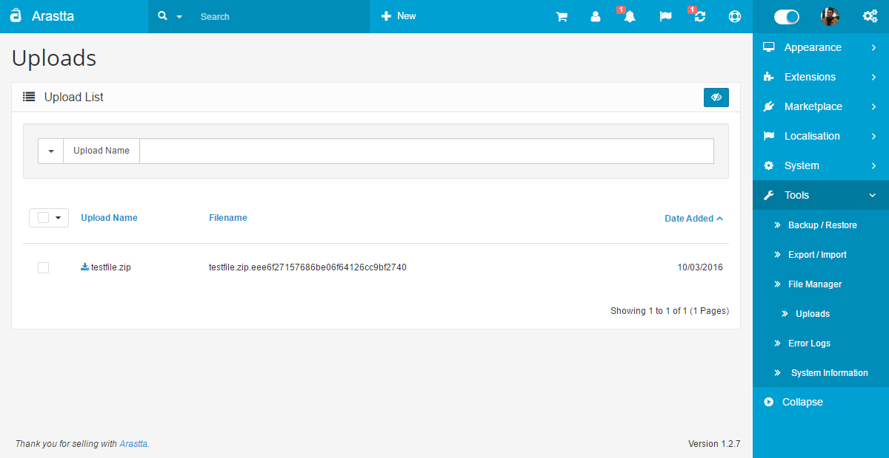
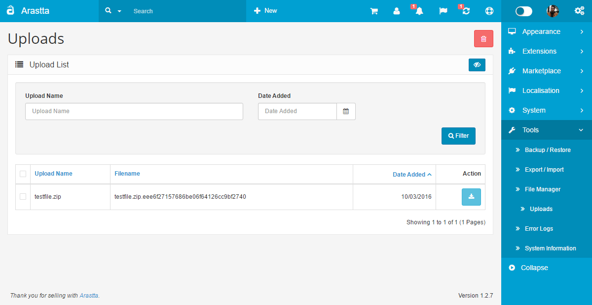

Uploads
=======

   You can switch between Basic and Advanced modes from the tabs below.

<ul class="uk-tab" data-uk-tab="{connect:'#doc-tabs', animation: 'fade'}">
    <li><a href="">Basic Mode</a></li>
    <li><a href="">Advanced Mode</a></li>
</ul>

To access the Uploads section in your Arastta admin panel, click on **Right Menu > Tools > Uploads**.

Basically, this is the list of all uploaded files from customers. These files are uploaded from the "File" field of products [options](docs/user-manual/catalog/options) or customers' account/address pages. The second is called "[Custom Fields](docs/user-manual/customers/fields)".

It allows store owners to download or delete the files. The search field helps to find the file and the date field helps to filter files according the uploaded date.

<ul id="doc-tabs" class="uk-switcher uk-margin">
    <li markdown="1">
Using Bulk Actions
-----------------------------

Bulk Actions describe the process to be performed on particular Files. These Actions can be performed on one, or more Files, at one time, if those Files have been previously selected. Bulk Actions are available, when appropriate, as choices in the Actions pulldown box, above each Table. There is only one Bulk Action allowed, **Delete**.</li>
    <li markdown="1"></li>
</ul>

The Action button on the right side allows you to download the uploaded file from your Arastta store. Respectively, the Delete button allows you to remove the selected file.