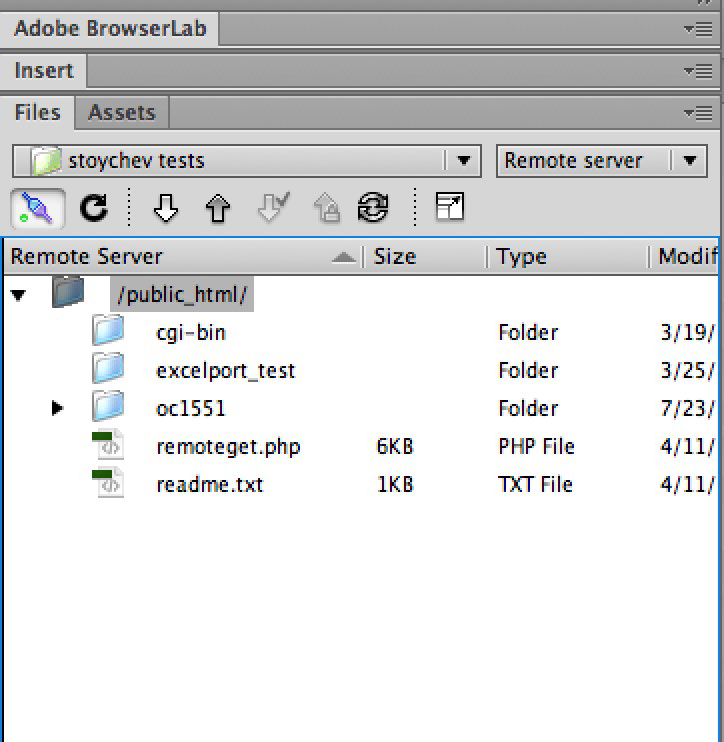
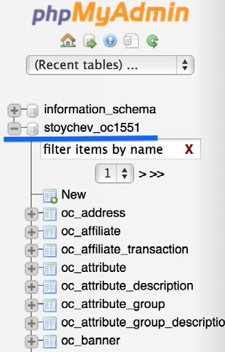
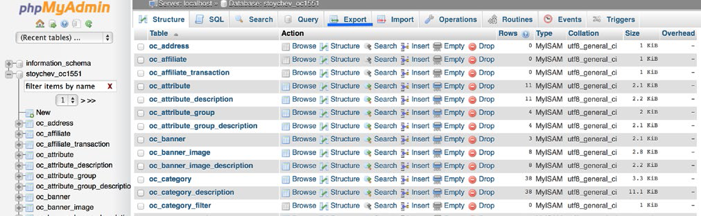
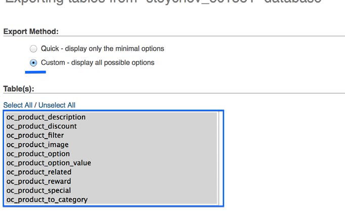
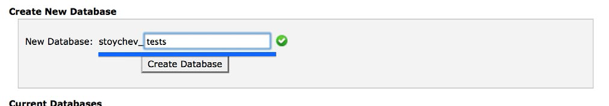
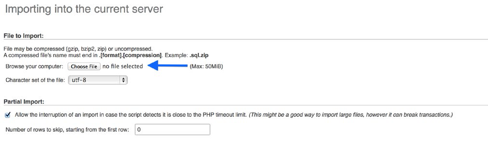
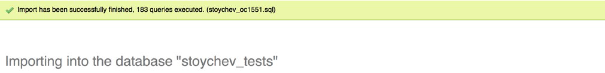

Step-by-step Arastta Migration to a New Server
===============================

Arastta is one of the simplest and loveliest e-commerce platforms. In this article we want to present a detailed step-by-step guide of the necessary steps you need to take in order to migrate your Arastta store to a new server.

##Setting up our station

Before we begin with our guide, it is best to do some prep and set up our station. As a first, we always recommend backing-up of your Arastta store and database. Some hostings offer automatic back-ups, so in case your hosting provides this feature, you can fast forward to Importing your Arastta database. If your hosting
does not come with automatic back-up please read on.

##Backing up our Arastta store contents

As a first, you will need to connect to your host via FTP. In this example we will use Adobe Dreamweaver, but if you are looking for an alternative, Aptana, FileZilla or any other FTP client will do the job as well.

This is a familiar picture of how things look when connected to your FTP server. You will immediately spot the public_html folder (at the top of the page). In case you are wondering what this public_html is, it is the web root for your primary domain name. It serves as a master cabinet where you put all website files and folders. Double click on the public_html so we reveal its contents. Now, we need to locate our Arastta installation folder. In this example we have named it oc1551 folder.

> Disclaimer: In some cases there may not be a public_html folder or it may be named differently.

Double click on the Arastta install folder we will select all of the files in the directory and get them. By “get” we mean that we will get them from your server and copy them to your local environment. To do this, can click on Ctrl + A/ CMD + A on a Mac and Get/Copy the files. To have everything organized neatly, we recommend creating a folder and pasting the files there in the folder.

##Backing up our MySQL

Next, we will need to get a copy of your database. A database is an electronic filing system allowing a user to quickly pull out content out of it. We will use phpMyAdmin in this scenario, which is available in your Cpanel. Cpanel is a graphical user panel from where we are going to access phpMyAdmin. Your hosting should provide you with access information to your Cpanel.

Once you login at your Cpanel, you need to go to phpMyAdmin. After this, please select the database name from the left hand menu.

Next, you will see the tables of the database. Right after we verify that we have selected the correct DB (Server name and Database are listed on the top), we need to click on Export.

Then, we need to select Custom Export. We need to make sure all of the tables are selected and proceed to the next title Output:

> Disclaimer: In some cases there may not be a public_html folder or it may be named differently.

After we are done with the above listed steps, we need to go all the way down and click on Go. Disregard other options as we do not need them for now. This will finalize the back-up of your website and DBs so now we are ready to upload files to the new server and create a new database. Get ready.

##Uploading Arastta to the new hosting

Remember the folder that we have stored your website? We need to open it up and upload the information back on the new hosting you have purchased. To do this we will need to connect to your new FTP server. Please fill in your username and password. Once we connect, we have to expand on the public_html folder and use “Put” button to upload the files. Once all files are uploaded we may proceed to the next step.

##Creating MySQL Database

To create a MySQL Database we need to login to the Cpanel of the new hosting. Make sure you use the new hosting details. After we login we need to create a database name.

To do that click on the MySQL Databases icon under the Database section. Click on the Create new and give your database an unique name.

Once you do this we need to proceed to phpMyAdmin. There we will import the backed up database.

Once we are in phpMyAdmin, we need to make sure the database we created is present. To do that just make sure you check your left column. To make sure it is empty you can click on the database name. After we have made sure the database is created and empty we need to go to the Import tab.

Next we need to click on Browse and select our backed up database and upload it.

Please be patient as the larger database, the more time it will require to upload.

##Editing Config files

Next stop, we need to edit the define.php and admin/define.php. To do so open Dreamweaver/Aptana, FileZilla or the FTP client you are using and connect to your new server. You will find define.php in the parent Arastta directory. Open the define.php for editing.

Now, we will need to edit the following lines of code (30-45) in our example, located under // DIR:

    define('DIR_BASE', 				$base . '/');
    define('DIR_ROOT', 				implode(DIRECTORY_SEPARATOR, $parts) . '/');
    define('DIR_INSTALL',     		DIR_ROOT . 'install/');
    define('DIR_SYSTEM', 			DIR_ROOT . 'system/');
    define('DIR_ADMIN', 			DIR_ROOT . 'admin/');
    define('DIR_CATALOG', 			DIR_ROOT . 'catalog/');
    define('DIR_VQMOD', 			DIR_ROOT . 'vqmod/');
    define('DIR_IMAGE', 			DIR_ROOT . 'image/');
    define('DIR_DOWNLOAD', 			DIR_ROOT . 'download/');
    define('DIR_UPLOAD', 			DIR_ROOT . 'upload/');
    define('DIR_CONFIG', 			DIR_SYSTEM .'config/');
    define('DIR_CACHE', 			DIR_SYSTEM . 'cache/');
    define('DIR_LOG', 				DIR_SYSTEM . 'log/');
    define('DIR_MODIFICATION',		DIR_SYSTEM . 'modification/');
    define('DIR_LANGUAGE',			DIR_ADMIN . 'language/');
    define('DIR_TEMPLATE', 			DIR_ADMIN . 'view/template/');
    define('DIR_APPLICATION', 		DIR_ROOT . 'admin/');
    define('DIR_LOGS', 				DIR_SYSTEM . 'log/');

> Notice: Please put your website Cpanel username under system username.

Next, we need to edit the Database entries lines (9-14) in config.php:

    define('DB_DRIVER', 'mysqli');
    define('DB_HOSTNAME', 'localhost');
    define('DB_USERNAME', 'root');
    define('DB_PASSWORD', '');
    define('DB_DATABASE', 'arastta_dev113');
    define('DB_PREFIX', 'o93_');

Please fill in your USERNAME, PASSWORD and DATABASE under the ‘DB_USERNAME’, ‘DB_PASSWORD’ and “DB_DATABASE’.

After we are done editing the define file we need to right click on define.php and select Set Permissions. We recommend setting the permissions of define.php to 444. This will make the file as read-only.

Next stop, we need to repeat the same procedure with admin/define. php file. We will find the file under admin/define.php. Again we will edit the database settings and change the permissions of the admin/define.php file to 444.

##Update of Name Servers

As a last step we should update your name servers. Name servers configure the domain to point to the right host. Most hosting providers have their own name servers. The easiest way to go about this is to contact your hosting registrars and simply ask them to handle this for you. Please mind that this can take up to 48 hours to change.

So how did your Arastta migration go? Please let us know if there is anything we can help you with or if you have any questions or comments.
