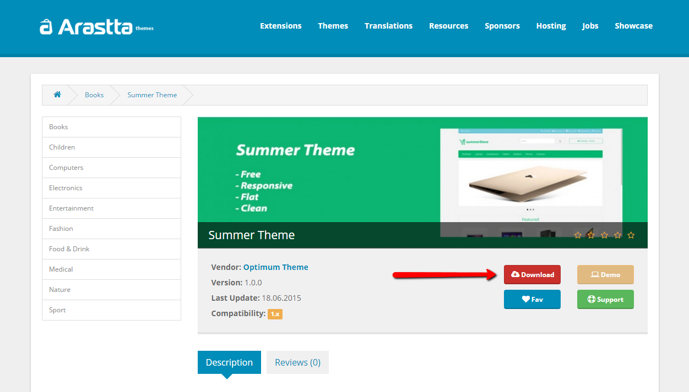

Theme Installation for Arastta
===============================

There are 3 ways to install an Arastta theme, one with Marketplace installer, second with extension installer and the third with manual upload.

###1) Marketplace Installer

1. Go to **Marketplace > Themes** and install the theme directly from [Arastta Marketplace](http://themes.arastta.pro/).
2. Proceed to **System > Settings > Design** and choose then theme name from the Template selector
3. Go to **Marketplace > Modifications** and click on the blue Refresh button (top right corner).

###2) Extension Installer

First, download the theme package from [Arastta Marketplace](http://themes.arastta.pro/).

Just upload the ZIP file from the **Marketplace > Extension Installer** page. The ZIP file must contain an "upload" folder with the files to be uploaded. The installer does also show the files that will be overwritten, in case there is any, before it runs the extension.

1. Proceed to **System > Settings > Design** and choose then theme name from the Template selector
2. Go to **Marketplace > Modifications** and click on the blue Refresh button (top right corner).

###3) Manual Upload

1. Extract the archive you downloaded from [Arastta Marketplace](http://themes.arastta.pro/) and locate the Arastta folder.
2. Upload the 4 folders found inside (**admin, catalog, image, system**) to your Arastta root installation and merge them with the existing ones.
3. Proceed to **System > Settings > Design** and choose then theme name from the Template selector
4. Go to **Marketplace > Modifications** and click on the blue Refresh button (top right corner).

##Multiple Theme per Store

Sometimes, especially when you have multiple stores and lots of product categories from different types, you may want to use different themes per store. For example let's say you have a clothes store and you sell clothes for women, men and children. You want to assign different themes for each store (women, men, children) with different styling and colors.

Just navigate to **System > Settings** page and assign your default template (store wide). Then navigate to **System > Store** and assign different themes for each of your store.
