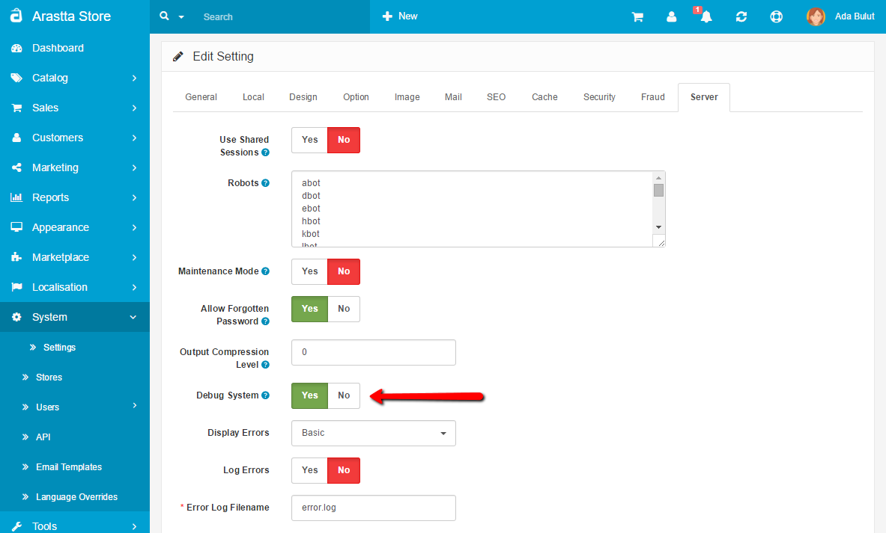
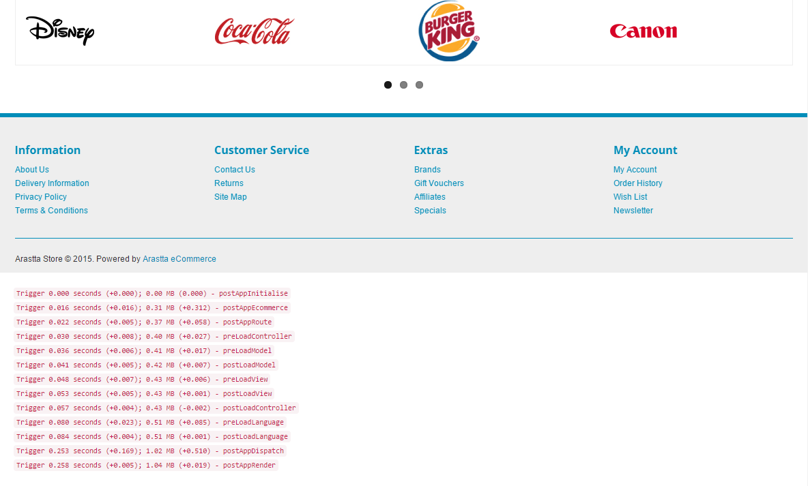

How to activate Debug Mode?
====================

When troubleshooting various issues in Arastta, you may find it beneficial to put your website in debug mode. Arastta ships with a convenient built-in debugger that lets you easily get access to the profiling, logging, and configuration data.

Go to the [Server](docs/user-manual/system/settings/server) tab under your store's settings in your admin panel and find the **Debug System** option. If enabled, diagnostic information (i.e. run time, memory) will be displayed at the bottom of every page of the store back-end and front-end.

> It is not advisable to leave the debug mode activated when running a live store.

When you visit your Arastta site again, you should see a list of debug information listed towards the bottom of the page (see the screenshot below). This information will be under a heading labeled:

For an advanced error report go to the [Server](docs/user-manual/system/settings/server) tab under your store's settings in your admin panel and change the **Display Errors** option to "**Advanced**".
