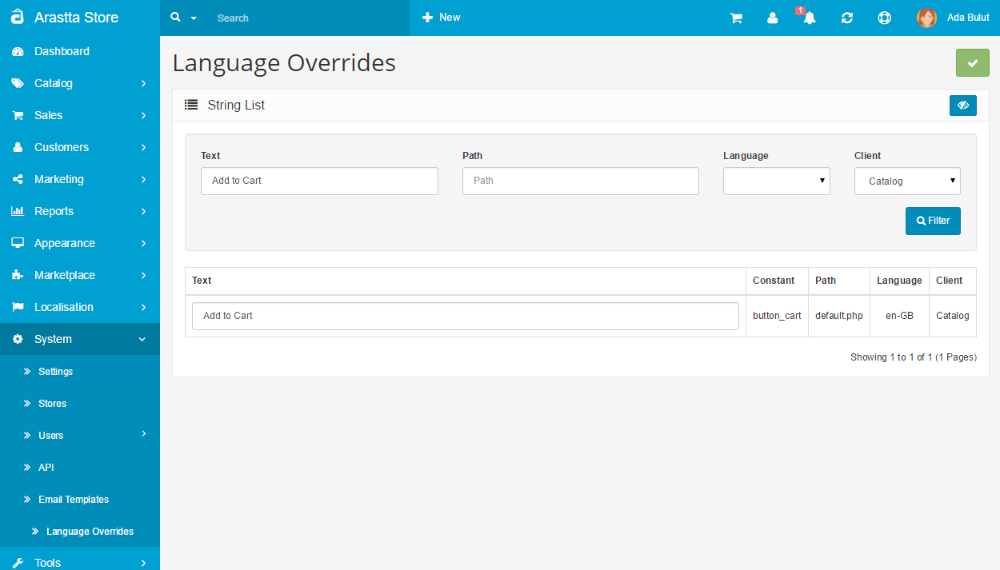

How to change language text?
============================

Changing language text
----------------------

One of the ways to make your store more unique and interesting is to change some of the text strings that are common for all online stores. This is why in this article we will show you how to change the “Add to Cart” text to something different.

##Step 1: Using Language Overrides

You can change any language text on the fly without hacking files and updates won't affect your change in any case. You can search and filter any string with ease. Also, the changes are stored in files which makes no affect to the performance.

This is the easiest way to change anything in texts all over Arastta store, not only the front-end but also the admin panel. You can find the text just by filtering the text and choosing the "Catalog" or "Admin" client.

##Step 2: Changing the language file manually

You just have to change the language string for that phrase and you are good to go. I will show you how to do this step by step. In the following example we will change the “Add to Cart” string for the English language, but this way is applicable for all languages on your store. Lets go!

1. Access your store’s files.
2. Navigate to *catalog/language/en-GB/default.php*.
3. Find the following string: 
`$_['button_cart'] = 'Add to Cart'; `
4. Replace it with: 
`$_['button_cart'] = 'Get it!';`
5. That’s it!

In the example above, we are changing the phrase with “Get it!”, but you can change it to whatever you want it to be. By doing this change, you will modify the string globally and it will not matter what template you are using, as long as the button text is not hardcoded in it.

###In Conclusion

As you can see, making this change is easy and effortless and it is not just that - you can check out all strings in that file and change not only this string, but all of them if you like.