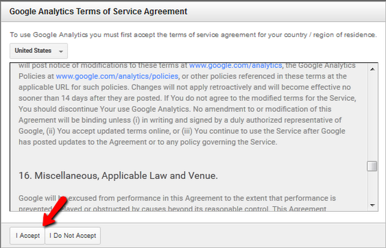

Integrate Google Analytics Tracking
===============================

How to obtain and configure Google Analytics tracking code with Arastta?
-------------------------------------------------

Google analytics helps you track the activity on your website. You can get a better idea of the traffic and conversion rate of your website. To start tracking your website’s traffic in-depth you will need a tracking ID. You can obtain this tracking ID by registering on the official [website](http://www.google.com/analytics/).

To Implement Google Analytics with your Arastta Store, you need to complete the following steps:

###STEP 1: Obtaining a Tracking ID

Select the **Sign in with Google Analytics** option and then click **Sign up**.

After you have typed your account details scroll to the bottom of the page and click on the **Get Tracking ID** button.

Now you will have to read and accept the Google Analytics Terms of Service if you agree with them. If you do not see the **I Accept** button and you cannot scroll down, use **ctr** and – to zoom out of the page.

You will now see your newly created tracking ID.

###STEP 2:  Implementing the Tracking ID in Arastta

Login to your Arastta admin dashboard and navigate to **System>Settings**.

Select the **SEO** tab and scroll down until you see the option **Google Analytics Code**.

Do not worry, if you already have a script in that field like the Zopim Live Chat widget. The two scripts will not interfere with each other and will both work correctly.
 
You have successfully activate Google Analytics tracking service for Arastta Store.