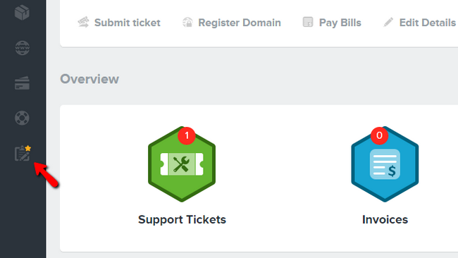
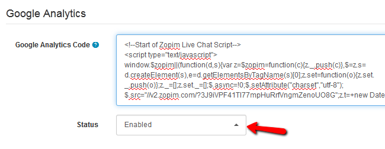

How to integrate Zopim Live Chat with Arastta??
=================

If you implement live chat to your Arastta store your customers will be able to contact you via it. This is very important as it enables you to provide them with support and help them choose products from your store. Zopim Live Chat has a free Lite version that we offer as an addon product and it can provide you with all features needed for a great customer support.

To implement Live Chat with your Arastta store, you need to complete the following steps:

###STEP 1: Adding Zopim Live Chat

To get Zopim Live Chat for your Arastta store you will first need to login to your FastComet client area and access the **Order** section.

Zopim Live Chat is listed as a product addon, so you will need to click on the **Product Addons tab**.

Scroll down till you see the "**Zopim Live Chat**" addon service. 

Click on the **Add to Cart** button to add the addon to your shopping cart. Once the ordering process is completed you will receive an email containing the login information for your Zopim account. 

###STEP 2:  Implementing Zopim Live Chat with Arastta

To implement the Zopim Live Chat you will need to login to your Arastta admin area and navigate to **System>Settings**.

Select the **SEO** tab and scroll down until you see the option **Google Analytics Code**.

Paste your Zopim live chat widget here and select **Enable** from the drop-down menu below. When you are ready click the **Save** button at the top of the page to save the changes.
 
Now you should see the live chat interface in the front-end of your store. To start monitoring the chat requests, login into your Zopim dashboard.