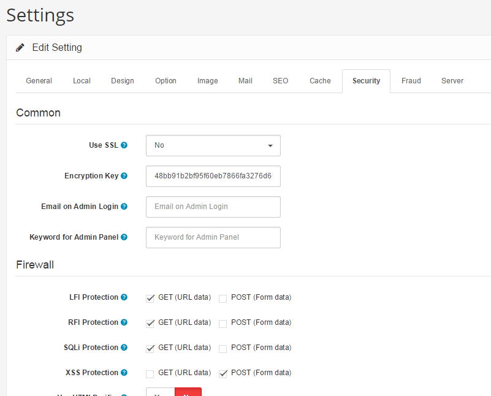

How to increase the security
============================

Customer information, business data and payment details are all highly sensitive, confidential commodities that are traded or shared as part of an e-commerce transaction. The press often reports on businesses that have fallen victim to hacking and data breaches, due to insufficient security measures, leading to legal and financial liability, as well as a negative impact on the company's reputation.

While Arastta is not responsible for the securing your website, it aims to offer the best protection practices around the web including encryption keys, notification emails, secure admin paths, firewall and a lot more.

The following suggestions aim to improve your Arastta store's security.

Delete the install folder
-------------------------

Arastta will automatically delete the install folder after the installation is done, but if it still exists then you're strongly advised to delete it immediately. Arastta will warn you in the admin side about this.

Security settings
-----------------

Arastta ships with a lot of settings that increases the security of your online store. You can enter a custom URL key while accessing the admin panel and let the system send you an email when someone logs into the admin panel. The firewall included into Arastta protects you against SQLi, XSS, RFI and LFI attacks. The database prefix of Arastta is also being generated randomly which makes hard for a hacker to try an SQL Injection attack.



Directory protection
--------------------

### Admin folder

The admin directory is where you have access to your store's administration. People with access to your store administration will have access your editing your products, customer information, store settings, and more valuable information. Therefore, it is very important that the admin login be difficult to find and access.

#### Rename admin

Renaming the admin directory to something unrelated to the the admin is necessary to prevent unwanted eyes from discovering it's location. You can access your admin login through entering your store's location, then the path to the admin. For example, if the admin folder was changed to "cookiemonster", the admin login would be at "www.yourstore.com/cookiemonster".

#### .htaccess & .htpasswd

A .htaccess and .htpasswd file in the admin folder will prevent hackers from accessing your store, even if they discover the admin login location. Using .htaccess, you can deny all IP addresses from viewing your store, except the admin's IP address. A .htpasswd in the admin folder will require an additional password for the allowed administrator to access this directory.

### Catalog

The catalog can be protected with the traditional .htaccess file. Using file match can be useful for protecting important file types for your store, such as php and txt, rather than all of them. The following code can be used for .htaccess in your catalog folder:

```
<FilesMatch "\.(php|tpl|txt)$">
Order Deny,Allow
Deny from all
Allow from "your ip address"
</FilesMatch>
```

This will deny access to all template, php, and txt files.

File permissions
----------------

Thanks to the Filesystem component of Symfony used by Arastta, your store is safe against the 777 file/folder permission attacks. also, the following files can be set to 444 to prevent anyone else from writing to them:

- config.php
- index.php
- admin/index.php
- system/startup.php
