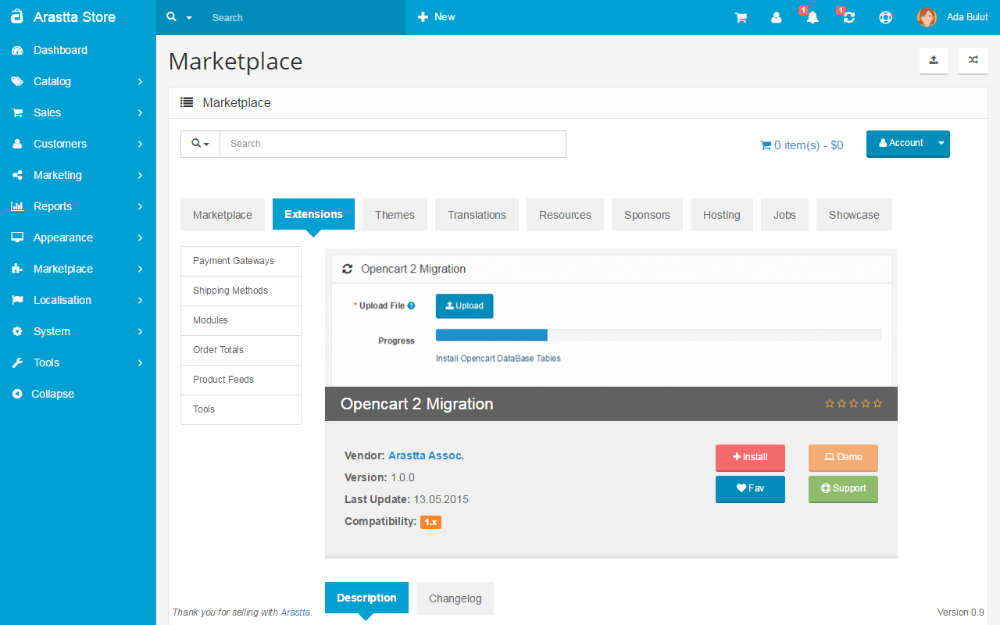
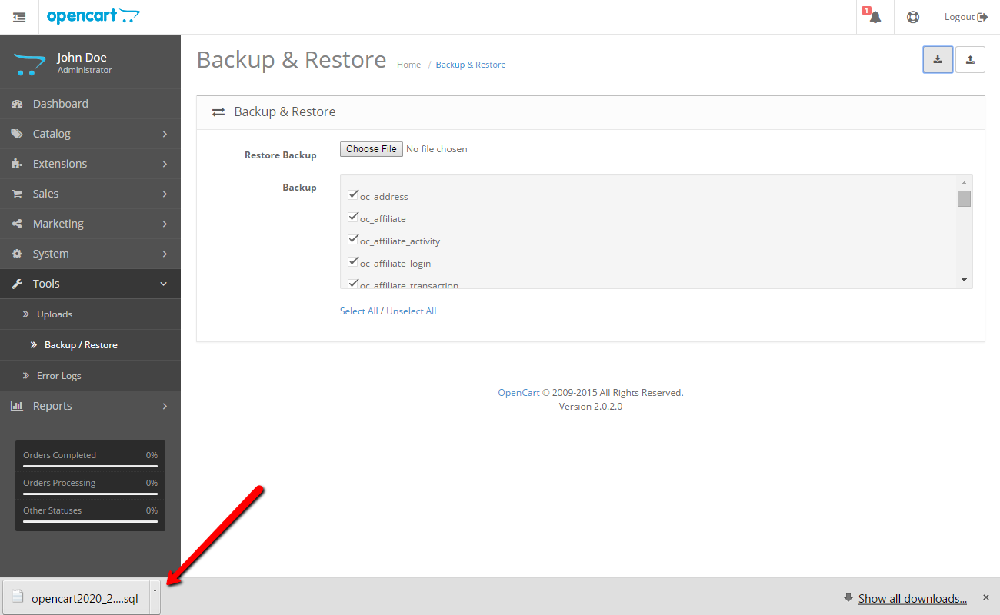
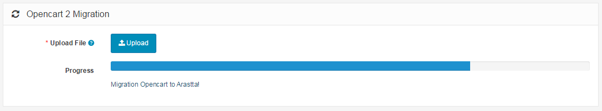

How to migrate from OpenCart 2?
============================

It is simple to migrate your data from OpenCart to Arastta. This process can be done only from OpenCart 2.x .

Apply the following steps to migrate from OpenCart 2.x to Arastta:

1) Go to "Arastta admin panel => Marketplace => Extensions", find and install the **Opencart 2 Migration** extension.

2) Go to "OpenCart admin panel => Tools => Backup / Restore", select all DB tables and get the backup file.

3) Go to "Arastta admin panel => Tools => OpencCart 2 Migration" and upload the backup file.

4) After the database migration you need to import images and downloads too.
  * For images, copy all files from OpenCart **"image/"** folder to Arastta **"image/"**
  * For downloads, copy all files from OpenCart **"system/download/"** folder to Arastta **"download/"**
