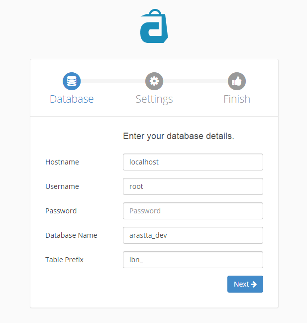
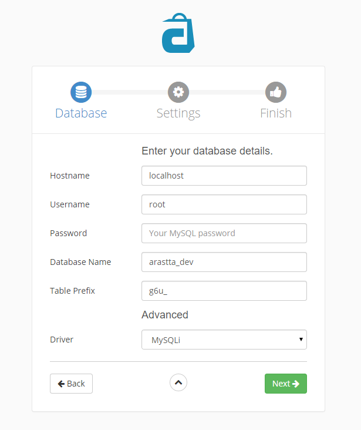
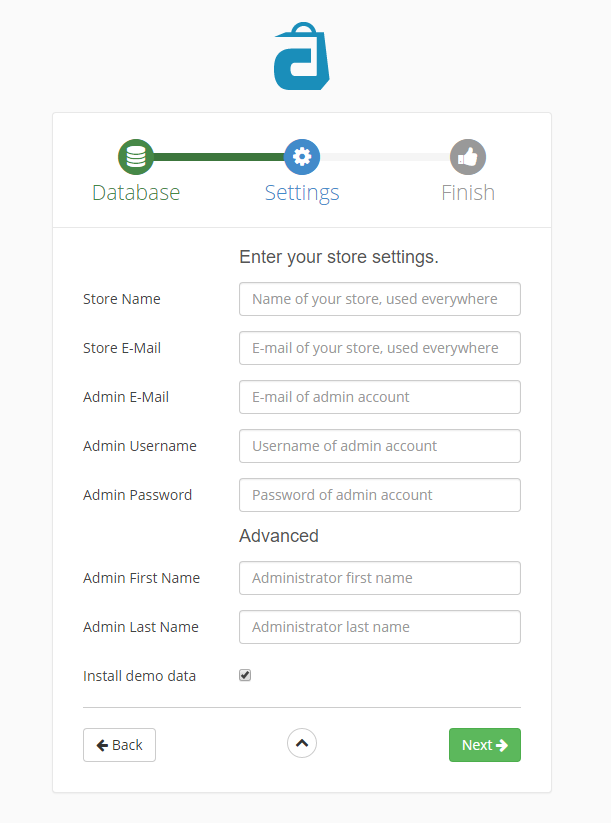

Installation
============

Quick set-up instructions for beginners.
----------------------------

This guide will walk you through how to successfully install and uninstall Arastta. Here you can find the [Detailed Installation](docs/detailed-installation) article for detailed set-up instructions.

<iframe width="740" height="493" src="https://www.youtube.com/embed/T9xXVGJsmrk?rel=0&amp;showinfo=0" frameborder="0" allowfullscreen></iframe>

Learn how to install Arastta eCommerce on your local or remote server in just minutes. For more please visit [Tutorials](http://arastta.org/tutorials).

Installation process
---------------------

1. Download the most recent [Arastta](http://arastta.org/download) package. The download page offers access to the latest and previous versions of Arastta.
2. Upload the downloaded package onto your server.
3. Unpack the Arastta archive to the web-root directory of your server.

Launch the Installer
--------------------
Open the link: *http://<your-domain>/<aarastta-directory>/* in your browser. It will start the installation wizard. 

### Step 1. Language

The first step is choosing which language you want to use. This is a good way for all who want to use a different language as default.

### Step 2. Database

You need to fill in the spaces by adding the database connection details (**Hostname**, **Username/Password**, **Database Name** and **Table Prefix**). Also the Advanced part (Driver) allows you to choose the database type. You can use any already created database or let Arastta create it for you during the installation.

### Step 3. Settings

This step allows you to add the **Store Name & E-mail** also to create a new **Admin E-mail**, **Username** and **Password** for administration access to the Arastta shop. And the Advanced part allows you to set the **Admin First & Last name**, also you can install or not the demo data.

### Step 4. Finished

Now that installation is complete. You now have the option to browse the store front or choose to log into the admin panel.

Updating Arastta
----------------

Arastta releases new versions from time to time with updated features and bug fixes. To learn how to update a store from an earlier version of Arastta, visit [Updating Arastta](docs/update).

Uninstalling Arastta
--------------------

Uninstalling Arastta is a quick and simple process.

1. Delete the files/folders in the location you uploaded them to in Filezilla.
2. Delete the Arastta database from MySQL Databases or phpMyAdmin.

<i class="uk-icon-exclamation-circle"></i> Once Arastta is uninstalled, all product and customer information will be lost. You can save a backup database file in case you want to reinstall Arastta at a later time. See <a href="docs/user-manual/tools/backup-restore">Backup/Restore</a> for more information.

Support
-------

If there are any issues regarding your store's installation or update, please visit the [Installation, Upgrade, & Config Support](forum/categories/listings/installation-upgrade) section of the Arastta community forum.
