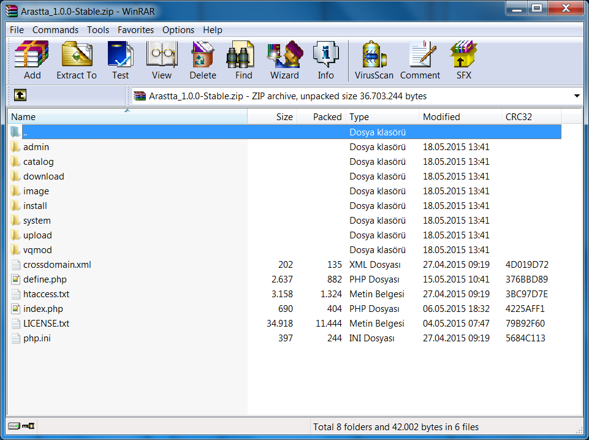
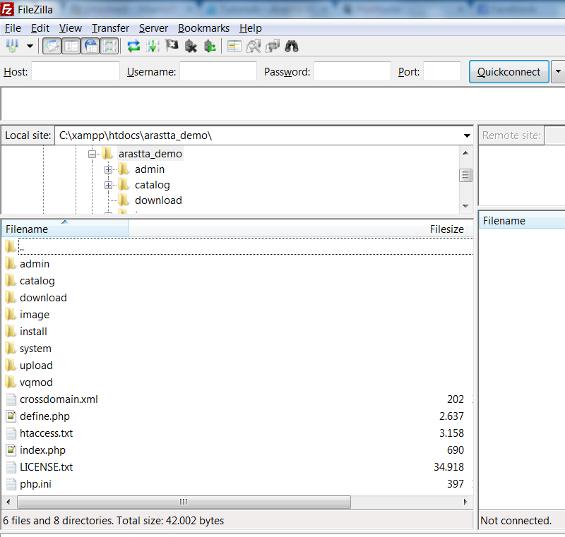

Installation
============

This guide will walk you through how to successfully install and uninstall Arastta.

<iframe width="740" height="493" src="https://www.youtube.com/embed/T9xXVGJsmrk?rel=0&amp;showinfo=0" frameborder="0" allowfullscreen></iframe>

Learn how to install Arastta eCommerce on your local or remote server in just minutes. For more please visit [Tutorials](http://arastta.org/tutorials).

Downloading and unzipping Arastta archive
-----------------------------------------

Arastta can be downloaded from the [Download](http://arastta.org/download) page. The download page offers access to the latest and previous versions of Arastta.

> If you don't have a program on your computer that can extract files from a ZIP file, [WinRAR](http://www.win-rar.com/download.html?&L=0) can be downloaded for free. Unzipping the ZIP file will uncompress the Arastta archive so the files can be accessed by a web server.

The downloaded ZIP file contains all the files needed to upload Arastta to a web server. The "LICENSE.txt" file contains the license agreement regarding the use of Arastta on your site. When you are ready, you can extract the files from the ZIP file to a location of your choice on your computer.

Uploading Arastta
-----------------

At this step you should have a web server established and the Arastta archive extracted. We will now use File Transfer Protocol (FTP) client to upload these uncompressed files to a web server.

### Installing and configuring the FTP client

We recommend using Filezilla as your FTP client. Filezilla is a free FTP client that will transfer the Arastta files to any web server specified. The FileZilla client (not the server) can be downloaded from [http://filezilla-project.org/](http://filezilla-project.org/) and installed onto a computer.

When you open Filezilla you should see your computer's file directory on the left side. The next step is to unzip and locate where you saved the uncompressed Arastta archive. The directory needs to be left open as we continue. The right hand side is blank at the moment because the target website hasn't been connected to. When connected it will display the file directory of the web server.

Before we continue, we need to make sure that you have the following information about your website:

- the host name
- username
- password

This information can be obtained by contacting your hosting provider.

### Connecting to the Site Manager

Under the “File” menu, “Site Manager” should be opened in Filezilla. A window will pop up with the General tab open. You should fill in the information gathered above regarding hosting information, and press “Connect”. The right “Remote Site” side will now display the file directory of your website.

### Uploading Arastta's files

If you haven't already located the Arastta package on the left side, you need to do so now and keep it open. In the Remote Site directory (right side), you need to open the folder that the Arastta shop will be located in. The location of shop varies based on whether the you want the shop to be seen on the main page, a sub-folder, a subdomain, etc. If you want to make Arastta the main page, you would need to upload files to the root folder of their website.

> Be aware that some hosting services require public files to be upload to a public directory, such as public_html, if they are to be visible on the website. You should check with your hosting provider to see where you can upload public files.

Once the location of the Arastta shop has been determined, all the content within the package folder on the computer's (left) side of Filezilla must be selected, right-clicked, and uploaded. Uploading all the files might take a few minutes on the FTP client.

> If you want the shop to be on the main page, for example www.shopnow.com, you must upload the contents of the package folder, but not the package folder itself. Including the package folder will create a sub-folder, making the shop available only on www.shopnow.com/upload.

After Filezilla finishes uploading the files to the location specified, you should see the same files on both the left side(computer) and on the right side (the website); as seen in the screenshot below:

The Filezilla window should look similar to the above image (minus some directory details). This means that the Arastta files were successfully transferred the target site. The site now contains the files necessary to setup an Arastta shop.

Launch the Installer
--------------------

We are now ready to install Arastta directly onto a website. You should open up a web browser and enter in the web address of where they uploaded Arastta.

This page is the installation page. The following steps will help you complete the installation process for Arastta.

### Step 1. Database

You need to fill in the spaces by adding the database connection details (Hostname, Username/Password, Database Name and Table Prefix). You can use any already created database or let Arastta create it for you during the installation.

### Step 2. Settings

This step allows you to add the Store Name & E-mail also to create a new Admin E-mail, Username and Password for administration access to the Arastta shop.

### Step 3. Finished

Now that installation is complete, the "install" folder is no longer required and it will be removed automatically by the system. You now have the option to browse the store front or choose to log into the admin panel.

Updating Arastta
----------------

Arastta releases new versions from time to time with updated features and bug fixes. To learn how to update a store from an earlier version of Arastta, visit [Updating Arastta](docs/update).

Uninstalling Arastta
--------------------

Uninstalling Arastta is a quick and simple process.

1. Delete the files/folders in the location you uploaded them to in Filezilla.
2. Delete the Arastta database from MySQL Databases or phpMyAdmin.

> Once Arastta is uninstalled, all product and customer information will be lost. You can save a backup database file in case you want to reinstall Arastta at a later time. See [Backup/Restore](docs/user-manual/tools/backup-restore) for more information.

Support
-------

If there are any issues regarding your store's installation or update, please visit the [Installation, Upgrade, & Config Support](forum/categories/listings/installation-upgrade) section of the Arastta community forum.
