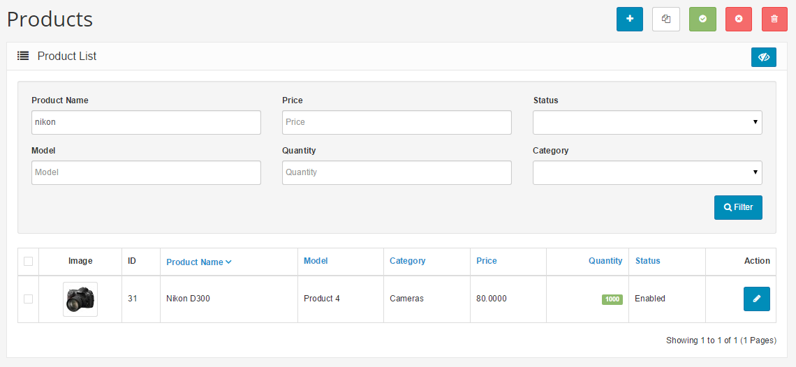

Filter
======

Filter is a handy tool used regularly throughout the Arastta administration. You may type into one of the information field for the item on the item list. Pressing Filter will "filter out" all the items in the list that do no match the criteria entered in the space, leaving only the items that match. With Filter, you can quickly locate any information stored in list form. Products, Categories, Customers, Reports, Orders, and more all use Filter as the main search tool to locate items in a list.

For examples, if you would like to look up a product in the product list, you can use "Filter" as a shortcut to search for that product. This can be helpful when there is large amounts of product and you would like to edit a specific product without having to browse through every page for it. The search boxes are located in the first row above the product list.

In the screenshot above, "nikon" is typed into the "Product Name" information field. "Filter" only displays what matches "nikon". The Nikon D300 is the only product displayed because it is the only product name containing the words "nikon" in this shop. If the "nikon" wording was present in more than one product name, the "Filter" button would display all of them.
