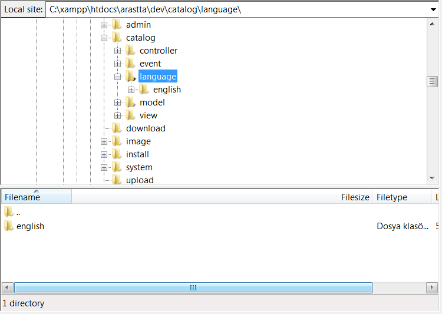

Languages
=========

Adding multiple languages
-------------------------

With shops serving a wider array of customers across multiple countries, it may become necessary to add multiple language options for your customers. The default language provided from the installation is English. Other available languages can be viewed on the Arastta [Language](http://translations.arastta.pro/) page.These language packs can be downloaded through the [Extension Directory.](http://extensions.arastta.pro/)

### FTP a language pack to an Arastta store

Any language pack that isn't English needs to be uploaded to Arastta, post installation, using an FTP client like FileZilla. Before we continue, please make sure that you have downloaded your language pack from the Extension Directory and uncompressed the download contents to a location on your computer. Connect to your Arastta store in the FTP client. Locate the root directory of where the Arastta store was installed. From there, open the path Catalog > Language. If this is your first time here, you will see an "english" folder already in this location. In Catalog > Language, upload your new language pack to this location.

### Adding a language to the administration

The Arastta administration requires some specific information in the System area about the language after you FTP it. Visit [Localisation ](docs/user-manual/localisation/languages)to see what fields are required. After the language is saved there, the language name will appear in the language list under Localisation > Language.

### Changing a language in the store front

Saving a language pack in Localisation will make it immediately available in the store front. The language area is located in the header of every page, next to currency. In achieve the example below, a German language pack was downloaded and FTP'd to Arastta. By assigning German an assorting order of 2, it is displayed right of English in the footer of every page of our store. The customer can click on the German flag in the header to change the language.

