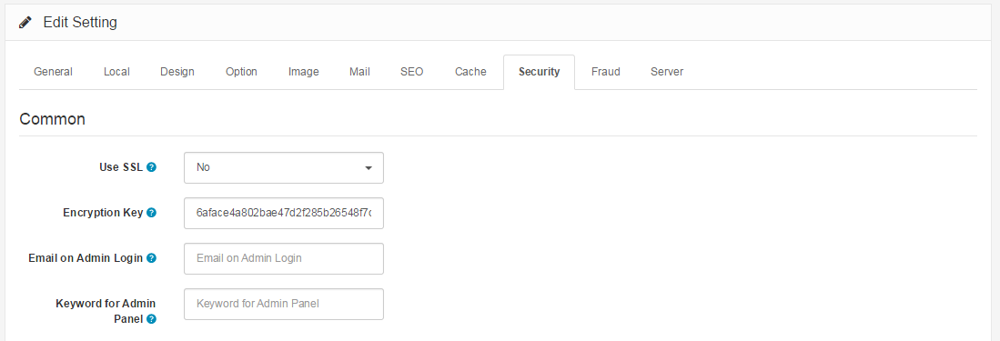

SSL
===

SSL Certificates and HTTPS
--------------------------

With sensitive customer and payment information being handled by your store, it is critical that you are able to secure that important information as it travels between web server and browser. As a result of this need, many store owners turn to [HTTPS](http://en.wikipedia.org/wiki/HTTP_Secure) for additional security. A [SSL certificate](http://en.wikipedia.org/wiki/Transport_Layer_Security) needs to be obtained and installed before you can enable HTTPS for your store.

Once the SSL certificate has been installed, go to the [Security ](docs/user-manual/system/settings/security)tabs under your store's settings in your admin panel. The first option in the Server tab lets you decide if you want to use SSL. Selecting "yes" will enable the SSL so that you can access your store through HTTPS.

