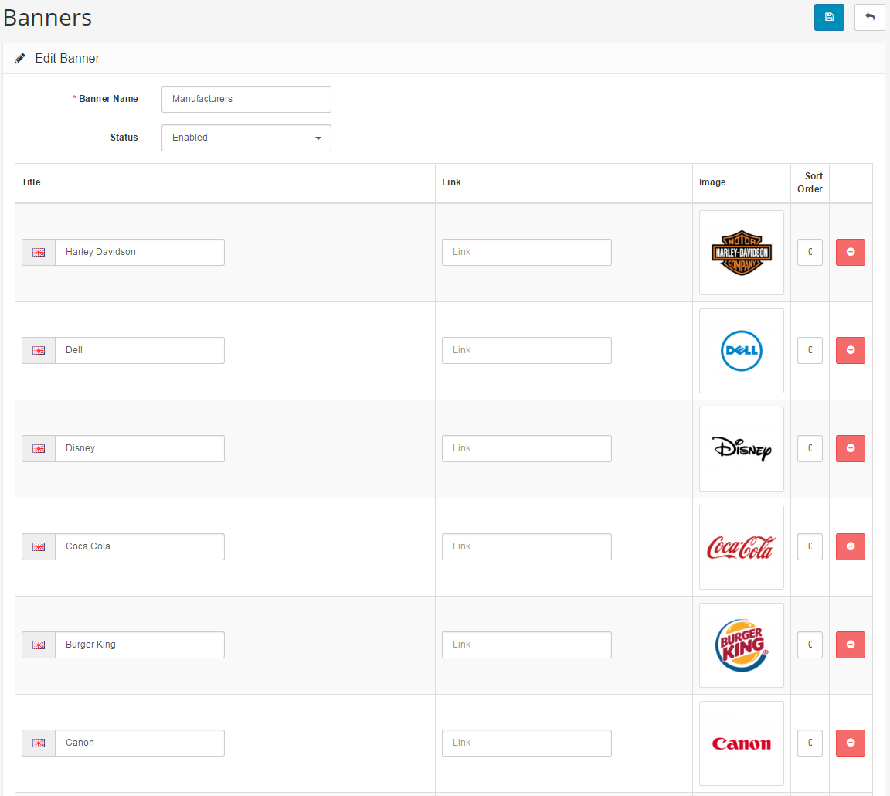

Banners
=======

Banners are pictures containing linkable images displayed in the store's store front. Banners can be utilized to catch the customer's eye and direct them to special products in the store. The Banners page under **System > Appearance > Banners** lets you customize the images and links displayed on the banners.

### Using banners in modules

The [Modules ](docs/user-manual/appearance/modules/overview)section uses banners for two modules: Carousel and Banners. The Banners section lets you customize what page layout the banner will be included, and its position. The Carousel module acts like a slideshow, or carousel. The customer can click an arrow to look through a range of product images.

If you want to create a new carousel banner displaying all the manufacturer logos, you need to go to **System > Appearance > Banners**, and click "**Insert**". After coming up with a banner name for later reference, you would to click "Add Banner" to add a new icon to the banner. The following fields are needed to add a new icon to the banner:

- **Title:** when the customer hovers their mouse over the icon, the title will be displayed.
- **Link:** the address of the page that the customer will be directed to when clicking on the icon in the banner. In this case, you would want to link the image to a banner page. The link doesn't need the "www.store.com" portion of the link.
- **Image:** add an image using the [Image Manager](docs/faq/image-manager).

You may add as many banners to the banner as necessary. Under [Modules](docs/user-manual/extensions/modules/overview), you can edit the Carousel to display the "Manufacturers Banner". The image below is the screenshot of the home page after the Carousel was assigned the Manufacturers banner. All the manufacturer logos that were added to the Manufacturers banner in the administration can be scrolled through in the store front.

It its a advised that you test the links by clicking on the images on the banner. If the clicks do not direct the user to the manufacturer location, double check to see if the page address was typed in correctly in the administration.
