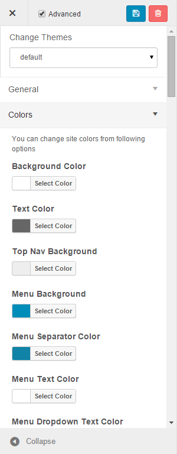

Customizer
==========

Theme Customizer
--------------------

Fundamentally, the Arastta Customizer system is a way to "skin" your store. Yet, it is more than just a "skin." Skinning your site implies that only the design is changed. Theme Customizer of Arastta can provide much more control over the look and presentation of the material on your website.

<iframe width="740" height="493" src="https://www.youtube.com/embed/oh9NWZ3p-cY?rel=0&amp;showinfo=0" frameborder="0" allowfullscreen></iframe>

With the built-in Theme Customizer of Arastta, you can change your storefront look, color scheme, fonts, and more live on site. No HTML or CSS knowledge required!

Let's say you want to change the background or button's color, with Arastta, there is no need to edit CSS. You can just open Theme Customizer and choose the desired color for the corresponding element.

##Get New Themes

The [Arastta Theme Directory](http://themes.arastta.pro/) is the official site for Arastta Themes which have been checked and inspected, and are paid or free for downloading. The site features the ability to search by type and style, and offers a demonstration of the page view elements of the Theme. Here you can learn [how to install a new theme](docs/faq/theme-installation).

<i class="uk-icon-check-circle"></i> There are many Themes available for download that will work with your Arastta installation. Arastta is based on OpenCart 2.0.1 version and we've tried our best to keep the compatibility with OpenCart <strong>extensions</strong> and <a href="http://www.opencart.com/index.php?route=extension/extension&path=1"><strong>themes</strong></a>. Here you can see the <a href="docs/developers/opencart-compatibility">OpenCart compatibility</a>.

If the Theme that you are installing provides instructions, be sure to read through and follow those instructions for the successful installation of the Theme. **It is recommended that Theme developers provide installation instructions for their own Themes**, because Themes can provide special optional functionality that may require more steps than the basic installation steps covered here. If your Theme does not work after following any provided instructions, **please contact the Theme author for help**.

##Using Themes

Arastta currently comes with 1 default theme. You can switch between Themes using the Appearance admin panel. Themes that you add to the theme directory will appear in the **Appearance > Customizer** as additional selections.

##Advanced Options

It will show a large list of advanced options for changing site colors as you wish. For example: **Background**, **Text**, **Menu**, **Breadcrumbs**, **Footer**, **Buttons**.

##Live Preview

As the new web technologies tend to move from "**cool code**" to "**cool interface**", we implemented an extremely easy to use theme customizer with live preview support. Whatever you do in the left side, is automatically applied to the right side so you could easily see how it looks like. You can change a lot of things such as colors, images, backgrounds etc. from there. You can change the style from full width to boxed and viceversa and also add custom CSS and JavaScript code.

##Extendable

Another cool part of The Customizer is that you can extend it by just editing the **customizer.json file** in the root of your theme.

##Super Fast

Unlike with similar feature on other CMS softwares, Arastta adds the changes into a **custom CSS file which affects the page load at 0%.**
