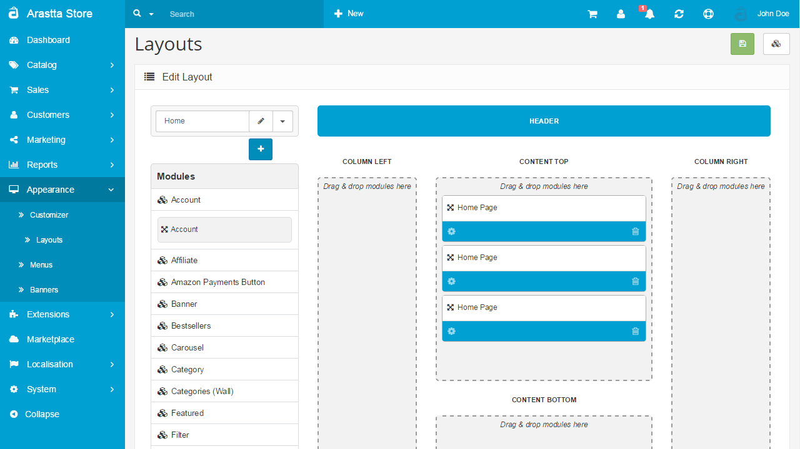
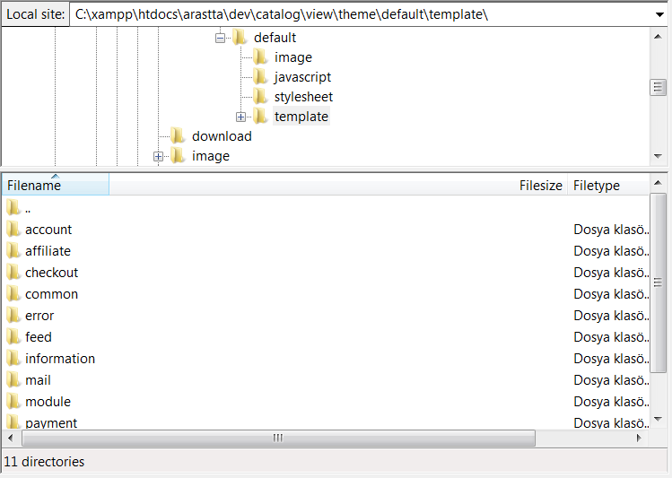

Layouts
=======

Layout Manager allows you to create new layouts or edit/delete existing layouts and assign modules to them by just dragging & droping. Positioning a module in content top, bottom, column left or right has never been easier.

Drag & Drop
-----------

If you're familiar with WordPress, you manage and assign modules/widgets from one place, Widgets page, by just dragging & droping them. Well, the Joomla and OpenCart users are not so lucky as they have jump here and there a couple of times (can't count them) in order to display a module/widget. Thanks to the built-in Layout Manager of Arastta, you can now achieve this process on your store as easy as with WordPress.

The Arastta default store provides the following page layouts:

- Account
- Affiliate
- Category
- Checkout
- Compare
- Contact
- Default
- Home
- Information
- Manufacturer Info
- Manufacturer List
- Product
- Sitemap
- Search

If you haven't done so already, you should take some time to [browse the store front](docs/user-manual/store-front). To become familiar with layouts available in Arastta, you should visit the different page types of your store front. The Manufacturer page layout has a different type of layout than the Checkout page, which has a different page layout than the Information page, and so on.

Creating a layout page from scratch takes some knowledge of web design and development. Once a layout page has been created, you should upload the files with an FTP client.

The location of the layout pages in the default theme is visible under /catalog/view/theme/default/template/ in the Arastta directory. You can see that all the page layouts from the default are included as folders above. To add a new layout page, you would need to upload the files under a new layout folder.

After the new layout page is uploaded to the location above, it can added to the store by clicking the "Insert" button under Appearance > Layouts. The new layout will require a layout name, the store the layout will be added to, and a route. The route is the folder name that the layout files are included in. Arastta knows to search for the folder under /catalog/view/theme/default/template/ in the store directory, so only the folder name is required.

Clicking "Add Route", then "Save" will make the new layout available in the store. See [Modules ](docs/user-manual/appearance/modules/overview)for more information on how to add a module to a specific layout page.
