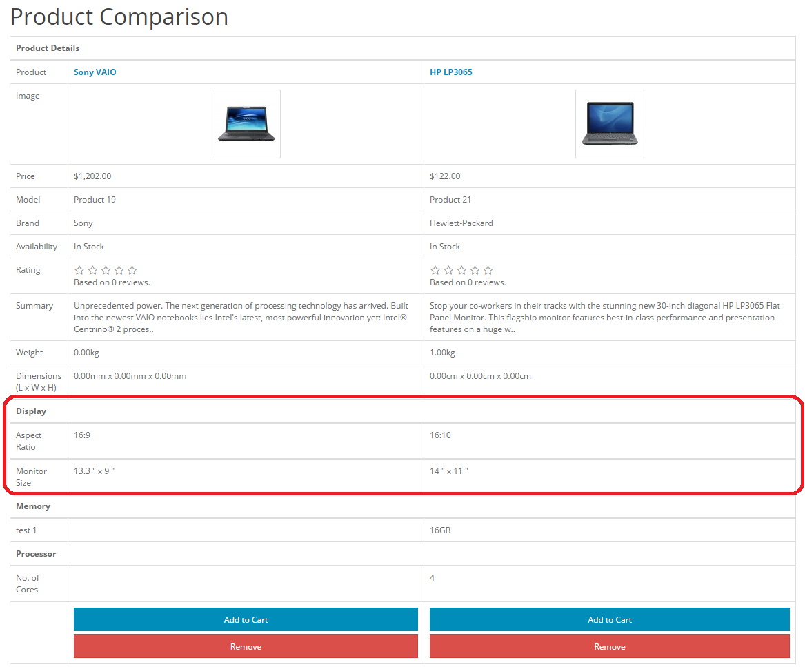

Attributes
==========

Attributes in the administration
--------------------------------

The attributes section lets you edit the attributes compared between products in "Product Comparison". When viewing products in the store front, customers have the option to add products to "Add to Compare" to analyze the similarities and differences between products in the store. Attributes can be used to describe the size, weight, color, and any other specifications of the product that have potential for comparison. You can create these attributes in the Catalog > Attributes area. To add attributes directly to products, visit the [Attribute ](docs/user-manual/catalog/products/attribute)tab under Products.

> Try to create universal attributes that are consistent across specific categories of products. For example, if your shop sells computer monitors, you could create a 'screen resolution' attribute. This attribute needs to be added consistently to all the computer monitor products in your store. It is more likely that a person will compare two computer monitors, rather than comparing a computer monitor and a random product with different attributes.

Attribute Groups
----------------

An attributes group contains related attributes that can be compared under Product Comparison. Attributes such as 'Clockspeed' and 'No. of Cores' can be organized under the larger attribute group of 'Processor'.

To create an attribute group, go to Catalog> Attributes> Attributes Group and click "Insert". This form only requires an attribute group name in "Attribute Group Name". Adding the "Sort Order" is optional. Adding a sort order will affect the arrangement order of attributes under Product Comparison. The attribute groups created here can have individual attributes added to them later.

Creating attributes
-------------------

In Catalog > Attributes, attributes can be created, edited, and deleted.

To create a new attribute, click "Insert". This button will direct you to a page asking for the "Attribute Name", "Attribute Group", and "Sort Order".

The "Sort Order" determines the position of the attribute if the product has multiple attributes assigned to it. The "Attribute Group" is the larger group of attributes that this particular attribute will belong to when assigned.

Attributes in the store front
-----------------------------

At this point in the guide, you should be familiar with creating attributes on the administration side; so let's see how creating an attribute in the back-end can affect the store front of the shop. For the purposes of this example, we want to add a 'Display' attribute group to help our customers compare the differences between "aspect ratio" and "monitor size" attributes for our default laptop products in our store.

Creating an attribute and attribute group for Product Comparison
----------------------------------------------------------------

The first step is to create a broader attribute group to store our individual attributes, aspect ratio and monitor size. We will create 'Display' as our attribute group, under Catalog > Attributes > Attributes Groups.

The next step is to create the specific attributes, Aspect Ratio and Monitor Dimensions, with descriptions under Catalog > Attributes > Attributes.

We type the name, Aspect Ratio, then assign it to the broader attribute group "Display". We assign 1 to sort order because we want this attribute to be above all the other attributes in the Display attribute group. When we click "Save", "Aspect Ratio" will be added to the attributes list. We create another attribute named "Monitor Dimensions", but we will change the sort order to 2, so that it appears below "Aspect Ratio" under Product Comparison.

Assigning the attributes to a product
-------------------------------------

Now that we have the attributes created, we need to edit the individual products to contain these attributes. To be consistent, we will add "Aspect Ratio" and "Monitor Dimensions" to all of our laptop products. We don't want a scenario where our customers need to compare different laptop products, but only one or two of our laptops has the "Aspect Ratio" listed to compare.

To add attributes directly to a product we go to Catalog > Products, and click edit for our HP laptop product. In the [Attributes tab](docs/user-manual/catalog/products/attribute), we add the Aspect Ratio and Monitor Size attributes individually. The text description must be manually added, so we add 16:10 to "Aspect Ratio" and 19.3" x 27.2" to our monitor size. As seen below, when we start typing "Monitor", both the attribute group and attribute name is displayed in the drop down box..

We will continue on by adding these two attributes individually to all of our laptop products.

Viewing the attributes in Product Comparison
--------------------------------------------

In the store front we added the Sony VAIO and HP LP3065 laptops to our product comparison from their respective product pages. Under the Product Details we can see our Display attributes group (highlighted by the red box). Since we gave the group a sort order of 1 when we inserted it into the attribute group list, it was the first attribute group displayed. Within the "Display" group, our "Aspect Ratio" and "Monitor Size" attributes are listed according to their sorting order. The specific text we included in the attribute section under Products is shown under each respective product column.

Our customers can now make a more informed decision with their purchase by comparing the Display attributes in Product Comaprions. Understanding how to use attribute groups and attributes with products can help raise the level of customer satisfaction.
