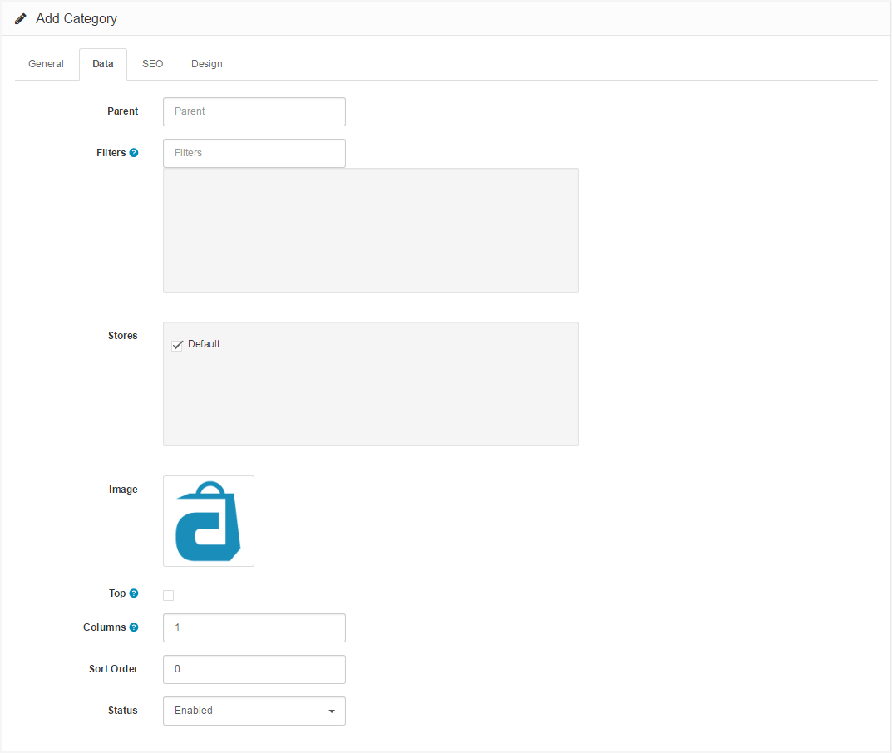

Data
====

Data Tab
--------

The Data tab asks for the following data:

- **Parent Category**: Categories are arranged in a hierarchical structure; with the parent category always on top. You may choose to create a category under a parent category, turning it into a sub-category. In the category list the category will be displayed as "Parent Category > Sub-Category". If "None" is selected, the category created will be a parent category.
- **Filters**: Map any pre-created [filters](docs/user-manual/catalog/filters) to a category. See Filter for more information on how filters work.
- **Stores**: If you are managing more than one store with Arastta, you may check which stores you would like to add this category to. If only one store is available, "Default" may be checked. See [Creating a multi-store](docs/user-manual/admin/multi-store) for more information about multi-stores.
- **Image**: Select the main image for the product page and the thumbnail for product listings. See [Image manager](docs/user-manual/admin/image-manager) for more information on how to upload an image using the image manager tool.
- **Top**: Checking this section will display this category in the top menu of every page. If no selection is made, it will not be displayed.

> The top menu only displays parent categories. If this category is a sub-category, it will not be displayed in the top menu.

- **Columns**: This number controls how many sub-categories are displayed when selecting the parent category.

> Shop owners with many product sub-categories may need to pay special attention to how many columns are allowed. If all the available sub-categories are allowed for a product category, the entire store page in the store front will be filled with sub-categories when hovered over.

- **Sort Order**: This sort order determines the position of the category in the menu. A sorting order of 1 would be displayed before a sorting order of 2, 3, and so on.
- **Status**: Selecting "enabled" makes the category publicly available in the store front. Selecting "disabled" will hide the category from the store front, but will still be available for editing purposes in the administration.

