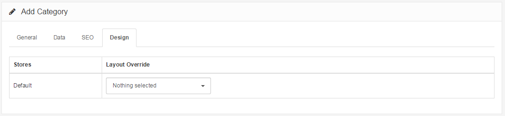

Design
======

Design Tab
----------

The design tab consists of the "Layout Override" feature. In this feature, you can choose to override a layout, such as the 'Account' page, to include the category on that page. For more information on layouts, see [Modules](docs/user-manual/extensions/modules/overview). You can just leave it blank for the meantime.

Pressing 'Save' in the upper right corner will save the information in the General, Data, and Design tabs, and add the product category to the category list. With the product categories created, you are now ready to add products to the shop.
