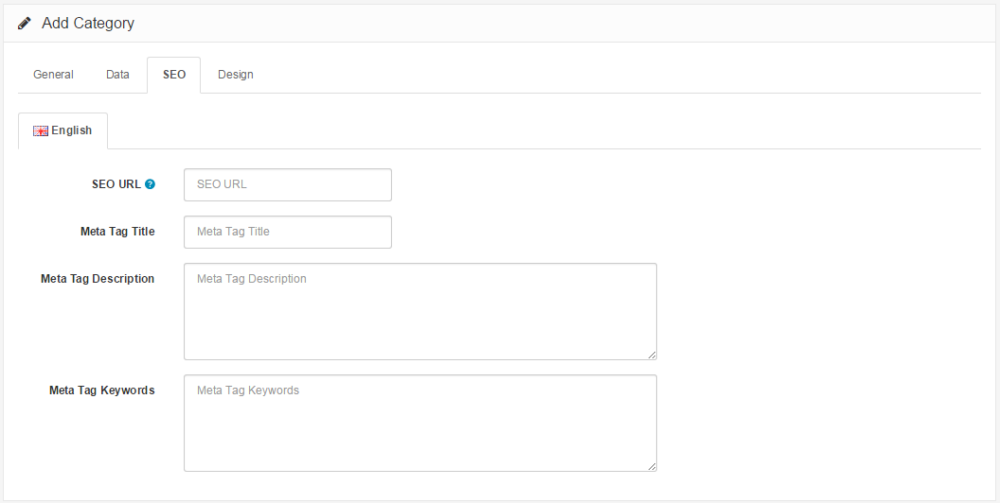

SEO
=======

SEO Tab
-----------

The SEO tab asks for SEO information regarding the product category:

- **SEO URL**: Do not enter site name or parent category, just the product URL. Leave empty if you want to be generated by the system automatically based on category name.
- **Meta Tag Title**: A title of the category to describe the category page to search engines.
- **Meta Tag Description**: A summary of the category to describe the category page to search engines.
- **Meta Tag Keywords**: Similar to meta tag description, but asks for a single keyword to describe the category.

