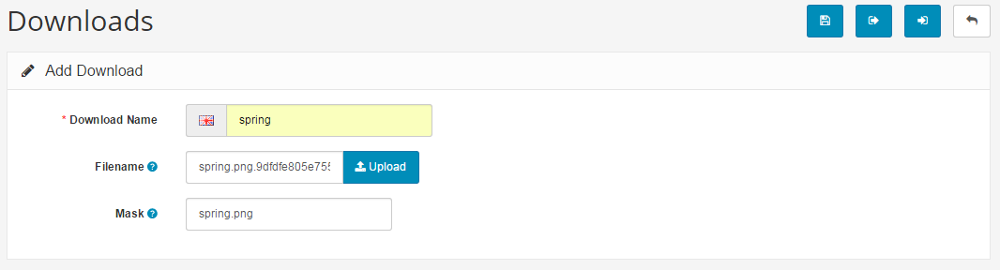
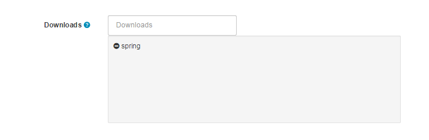

Downloads
=========

Adding new downloads
--------------------

This section is only applicable to you if you sell digital products, or products that have a downloadable component such as a PDF User Guide or similar. To insert a new download, you must give the downloadable product a name, upload the file, and set an allowance for the number of downloads per customer. The mask option allows the administrator to give the file a different visible filename. Press "Save" to submit the download information and save it.

With the download created, it must be manually added to the each individual product that the download will be included with. See [Links ](docs/user-manual/catalog/products/links)to learn how to add a download to the product.

The downloadable file will not be shown on the product page. Therefore, it is a good idea to describe how the customer will receive their download in the product description on the product page. The download will be provided for the customer once their purchase is complete. They should be advised to visit "My Account" > "My Orders" > "Downloads" (as seen below) to view their downloadable products. They will have the opportunity to download the file as many times as it was specified under "Total Downloads Allowed".

