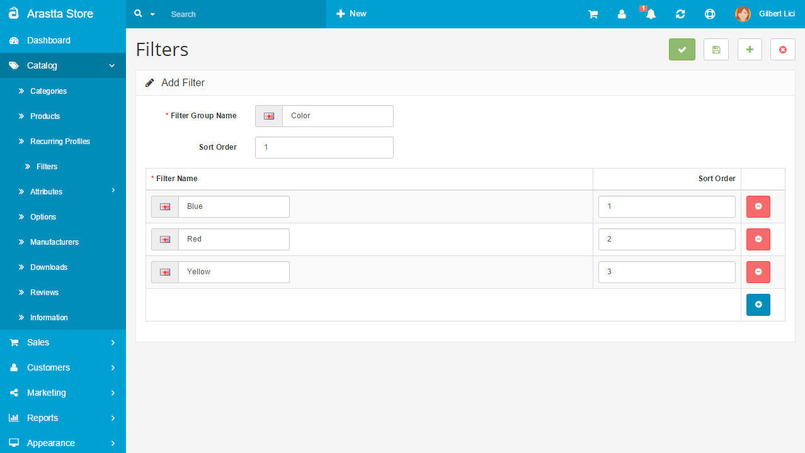
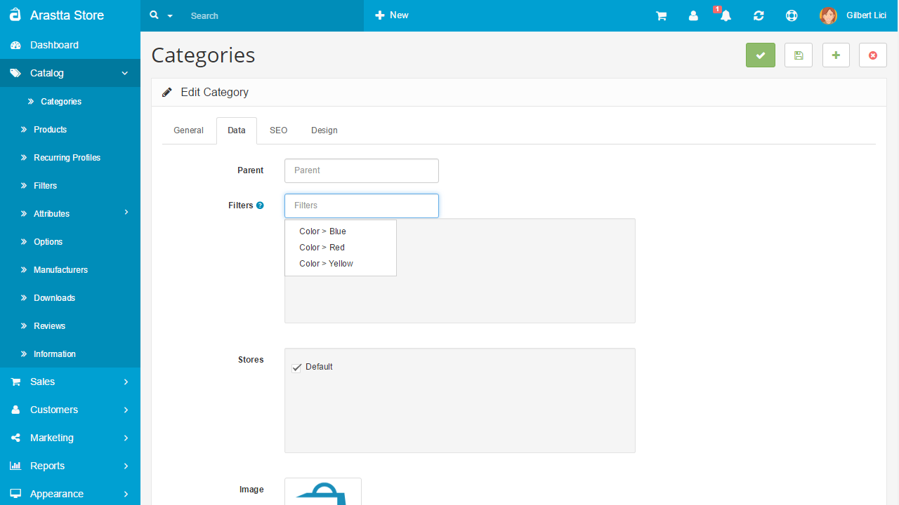
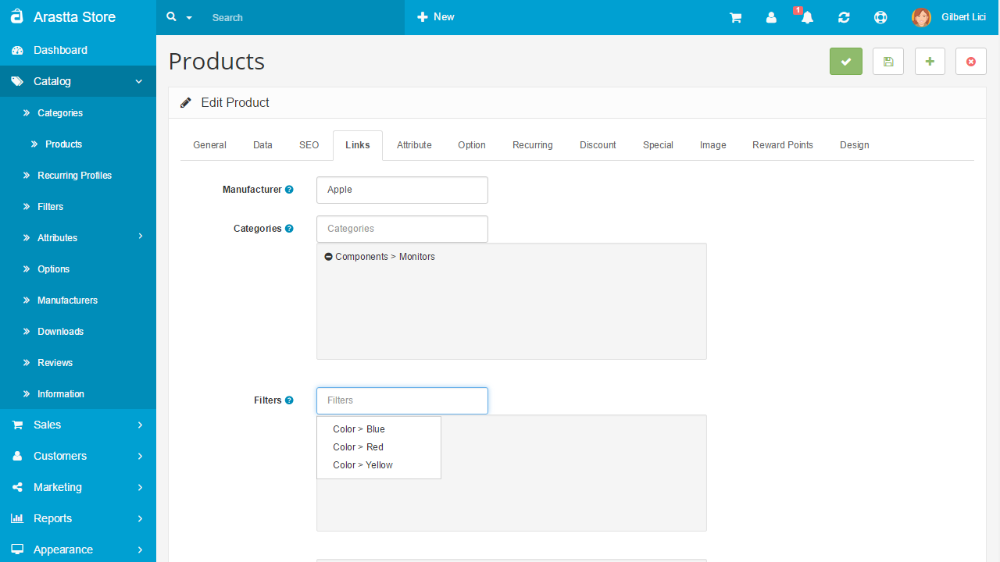
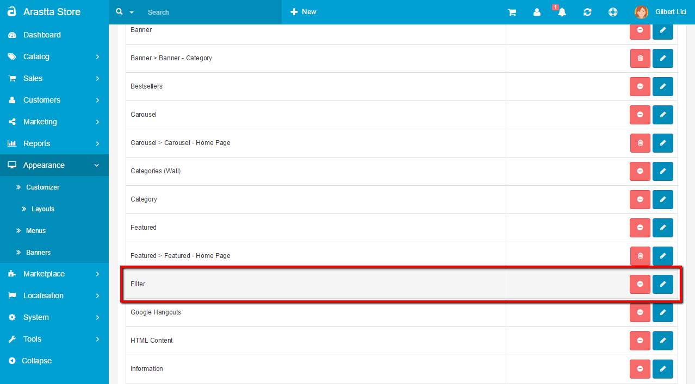
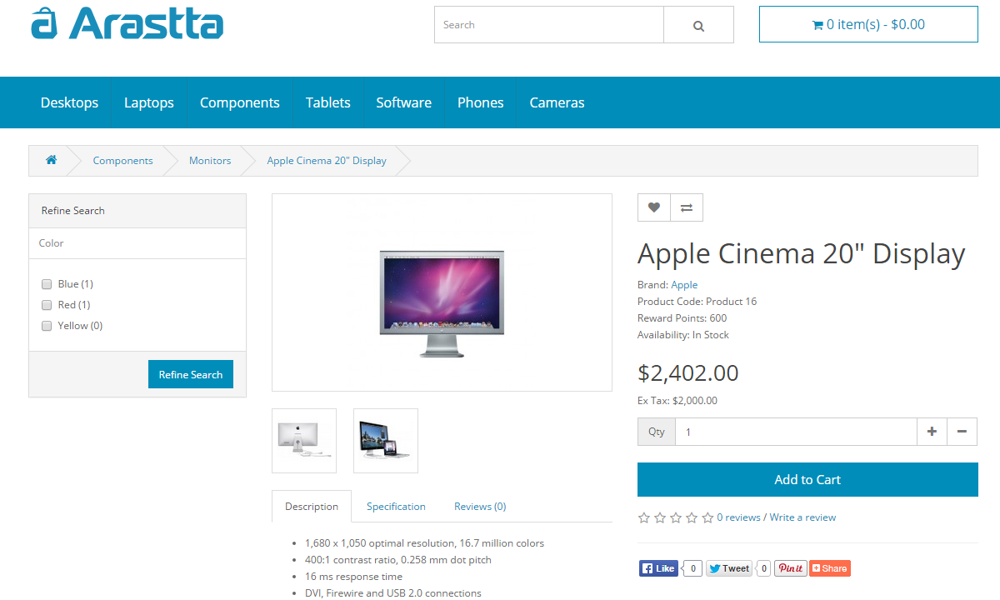

Filters
======

How to use filters?
---------

**Before starting**, keep in mind that filters can be shown only on category and product pages. Not home or any other page. Also, the Filters feature of Arastta does not make an "intersection" but "conjunction" of the selected options. Here you can find extensions that offers "intersection" filter.

### *Text Version*

1. Go to **Arastta => Catalog => Filters** and select **Insert** to create a filter group. Assign a filter group name (e.g. ***Color > Blue***) and add filter name values (e.g. ***Blue, Red, Yellow***).
2. Go to **Arastta => Catalog => Categories** and **Edit** a category. Under the Data tab add the filters you want to be able to apply to that category (e.g. ***Color > Blue, Color > Red***).
3. Go to **Arastta => Catalog => Products** and **Edit** a product. Under the Links tab add the filters which apply to the product (e.g. ***Color > Blue***). Apply to as many products as applicable.
4. Go to **Arastta => Appearance => Layouts => Modules => Filter**. If not installed select **Install**. Click **Edit** and set "Status" to "Enabled". 
5. Go to  **Arastta => Appearance => Layouts**.  Select "**Category**" or "**Product**" as layout page and set whatever position and sort order you would like.

[Here](docs/user-manual/appearance/layouts) you can find more info about how to show modules on a layout.

### *Screenshots Version*

1. **Create the Filter Groups**. Go to "**Arastta => Catalog => Filters**" and add new group by clicking insert button.
 
 
2. **Assign Filters to Categories**. Go to "**Arastta => Catalog => Categories**" and click on **Edit** on your category line. Then go to **Data** tab and write your filter name on "Filters:" textbox (don't use group name but filter name). Filters will appear on screen with autocomplete, please select your filter from the list then save (you can add many filters for each category with rewriting values).

3.  **Assign Filters to Products**. Go to "**Arastta => Catalog => Products**" and click on **Edit** on your product line. Then go to **Links** tab and write your filter name on "Filters:" textbox (don't use group name but filter name). Filters will appear on screen with autocomplete, please select your filter from the list then save (you can add many filters for each product with rewriting values).

4.  **Install the module**. Go to "**Arastta => Appearance => Layouts => Modules**" and activate the Filters module by clicking on the Install link.

5.  **Assign Filters module to Layouts**. Go to "**Arastta => Appearance => Layouts**". Select "Category" or "Product" as layout page and set whatever position and sort order you would like.

**Finally**, you can see your filters module on site, category page.

And on product page.

