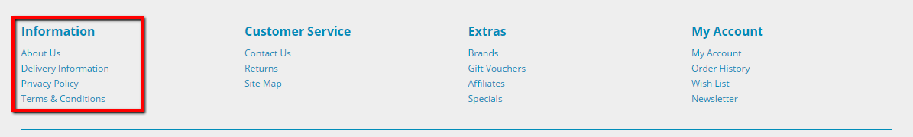
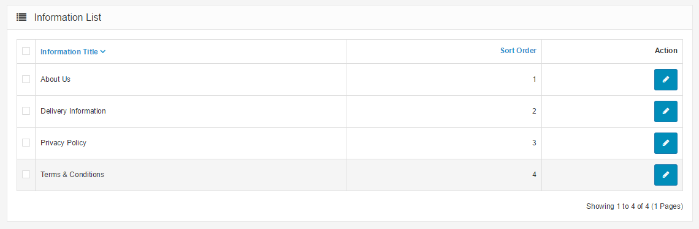
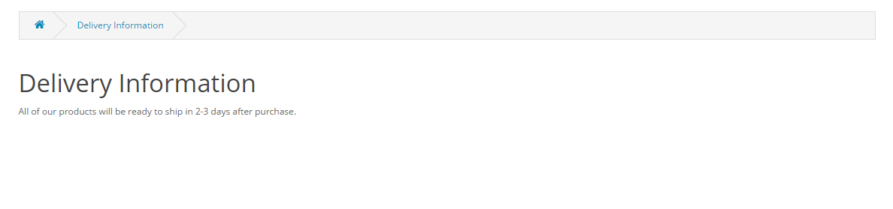

Informations
============

The Information section displays specific company information in the footer of every page (as seen in the screenshot below). See Information for more information on the footer page.

The Information page can be found under Catalog > Information. On this page the administrator will have the option to edit, delete, or insert a new Information page.

> About Us, Delivery Information, Privacy Policy, and Terms & Conditions are in the default because they are the most important Information pages used in online stores. We recommend that you edit these pages rather than delete them.

When editing or inserting these pages a description may be added, pages enabled or disabled, and SEO keywords created. There is an option to remove the page from the bottom of the footer.

### Information pages in the store front

In the screenshot below, the "Delivery Information" page is being edited in the administration under Catalog > Information. The Information Title will display the text entered as the title of that information page, while the description will be placed below.

The Data tab requires you to check the store that the Information page will be located in, if you have multiple stores. It also asks for a SEO keyword, a status option enabled (or disabled) to make the page public or not, and a sorting order.

The screenshot below is the result of saving the edited Delivery Information. A customer can access this page from the footer of any page in the store front by clicking "Delivery Information". There is an option in the Data tab above to remove a link to this page from the footer.

