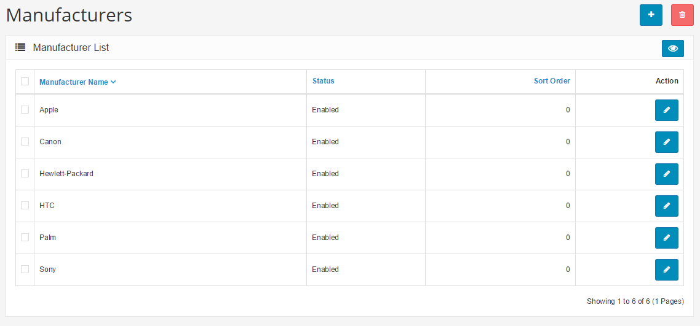
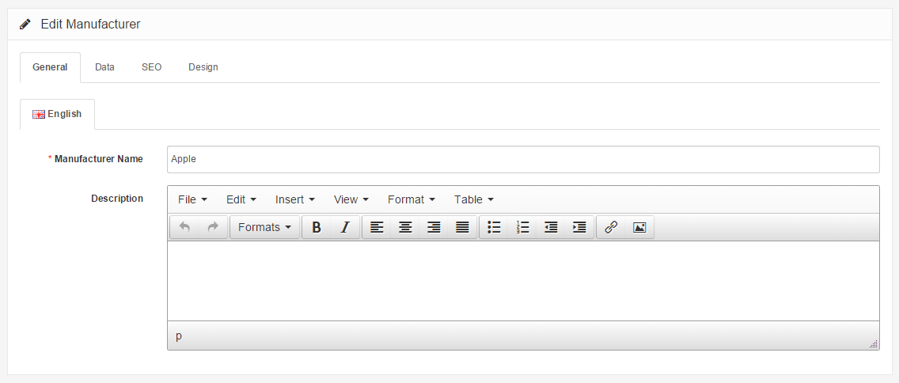
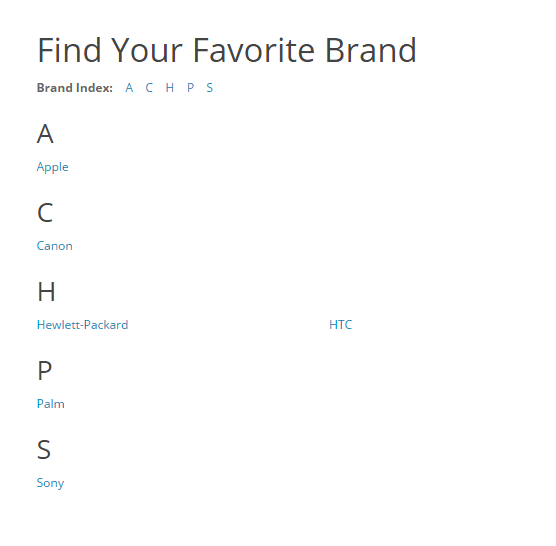

Manufacturers
=============

Manufacturers in the administration interface
---------------------------------------------

The Manufacturer section is used to categorize products by manufacturer. This section can be accessed under **Catalog > Manufacturers**.

The Manufacturer names below came with the install. They can be deleted, and new manufacturer information can be added in its place. The manufacturer information should be created before products are added, so the manufacturer category can be selected when adding the product. Saving a product without including the manufacturer isn't advised, because customers can search for products in the store front through their manufacturer page. With the manufacturer missing from the product information, the product will not be available on those pages.

To insert a new manufacturer, the following information is required:

- **Manufacturer name**
- **Description**: Text that will describe this manufacturer on the manufacturer page, to be viewed by the customers in the store front of the shop.
- **Stores**: Default will be selected if there is only one store. If you have more than one store using Arastta, you can add a manufacturer to multiple stores by checking on them.
- **Image**: an image of the manufacturer (optional). See the [Image Manager](docs/faq/image-manager) to learn how to upload images.
- **Sort Order**: the position the manufacturer will be sorted among multiple manufacturers (optional)
- **Status**: Enabling makes the manufacturer publicly available in the store. Disabling allows the manufacturer to be edited in the administration , but hides it from the store front .
- **SEO URL**: Do not enter site name, just the manufacturer URL. Leave empty if you want to be generated by the system automatically based on manufacturer name.
- **Meta Tag Title**: A title of the manufacturer to describe the manufacturer page to search engines.
- **Meta Tag Description**: A summary of the manufacturer to describe the manufacturer page to search engines.
- **Meta Tag Keywords**: Similar to meta tag description, but asks for a single keyword to describe the manufacturer.

To edit existing manufacturers you can locate "Edit" under "Action". Clicking edit will direct you to the form above with the previously filled-in manufacturer information.

<i class="uk-icon-info-circle"> The product will need to be reassigned to the newly changed manufacturer, if the manufacturer name is changed. If the manufacturer name remains unchanged, but any of the other information is edited, the product will automatically adopt the new manufacturer information.</i>

Manufacturers in the store front
--------------------------------

Manufacturers will always need to be assigned to products in the store inventory to affect the store front. See the [Products ](docs/user-manual/catalog/products/overview)section for more information on how to assign manufacturers to products in the administration. In the store front, the manufacturer "categories" serve to organize products under manufacturers. To illustrate how products are organized under manufacturers in the store front, we will create a new manufacturer and assign it to a product.

In the **Catalog > Manufacturer** section we created an 'Acer' manufacturer; added it to our only store ('Default'), while including an SEO keyword, manufacturer image, and sort order. Under Products we assigned the "Acer" manufacturer to the "Acer Aspire" product.

### The Manufacturers page

To access the Acer manufacturer page, the customer can go to the footer of any page; and under Extras they can click on Manufacturers.

The customer will then be directed to the manufacturers page, where all the manufacturer names are displayed alphabetically. We can see that our "Acer" manufacturer was automatically added to this page upon creation.

When the customer clicks on the "Acer" link, they will be directed to a page listing all the products within this "Acer" manufacturer. On this page, we can see that the "Acer Aspire" product is displayed because it was assigned the manufacturer,"Acer", in the Products section.

Clicking on the "Acer Aspire" will take the customer to its product page.

The "Acer" manufacturer page can also be accessed from the product page, under "Manufacturer". This link is helpful for exposing customers to different products of the same manufacturer in the shop. The customer can click on "Acer" to be directed to the manufacturer page, where they can browse other Acer products in the store.

### The carousel module

Adding a new manufacturer will not add the manufacturer icon to the carousel banner on the home page. The newly created manufacturer must be added to the manufacturer banner under System > Design > Banners for the icon to be displayed in the carousel. See the [Layout](docs/user-manual/appearance/layouts) section for more information on how to add the manufacturer icon to the banner.
