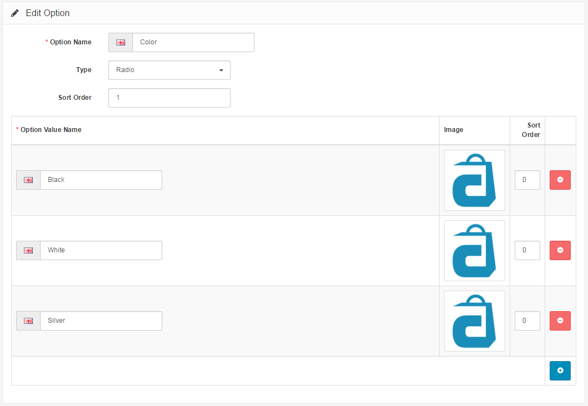
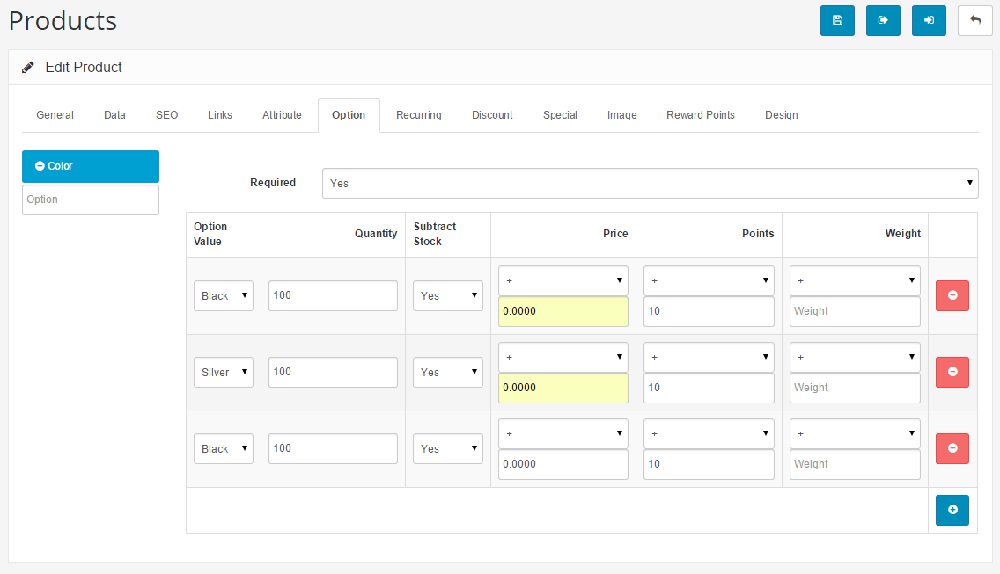
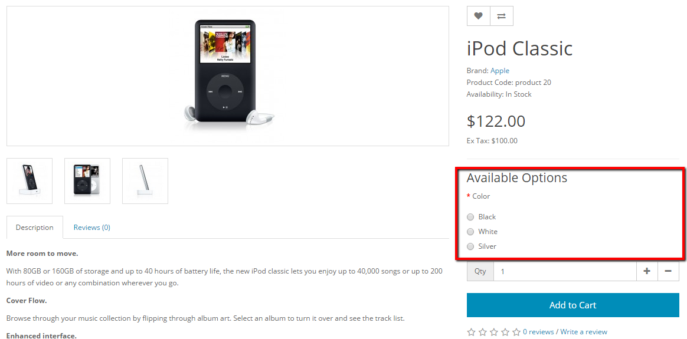
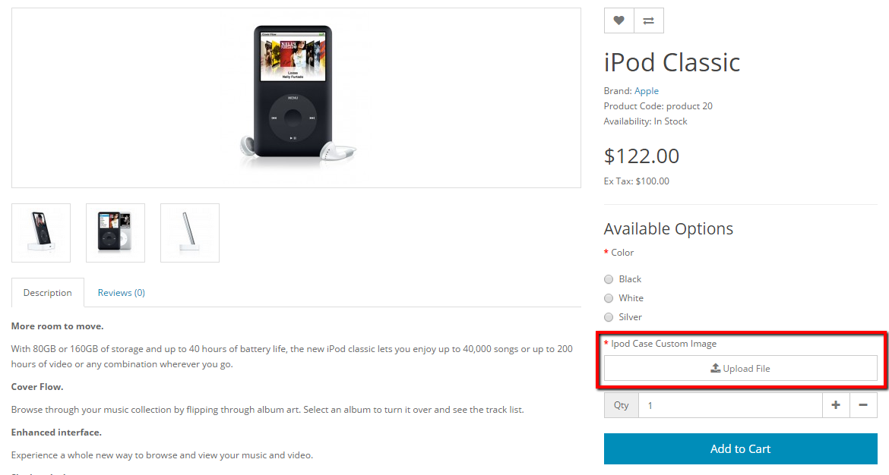
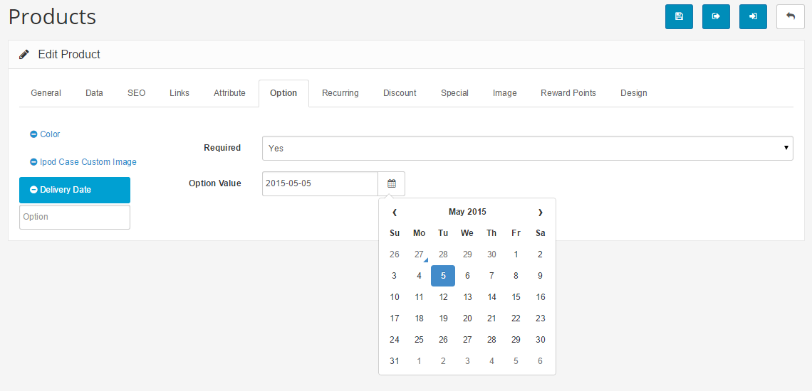
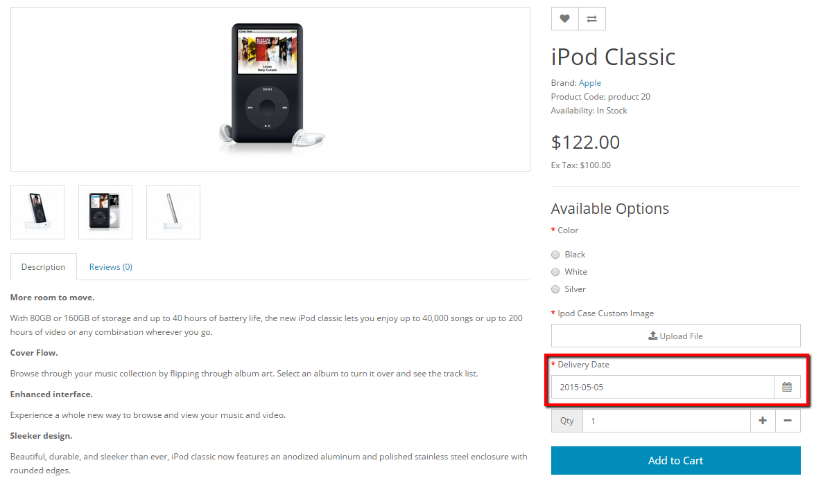
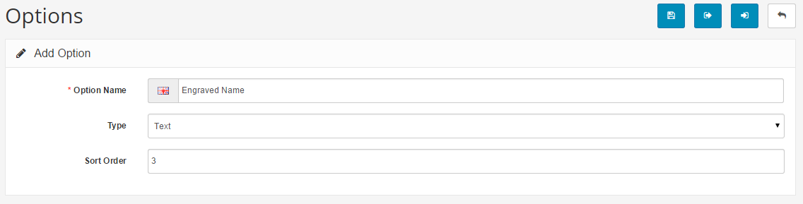
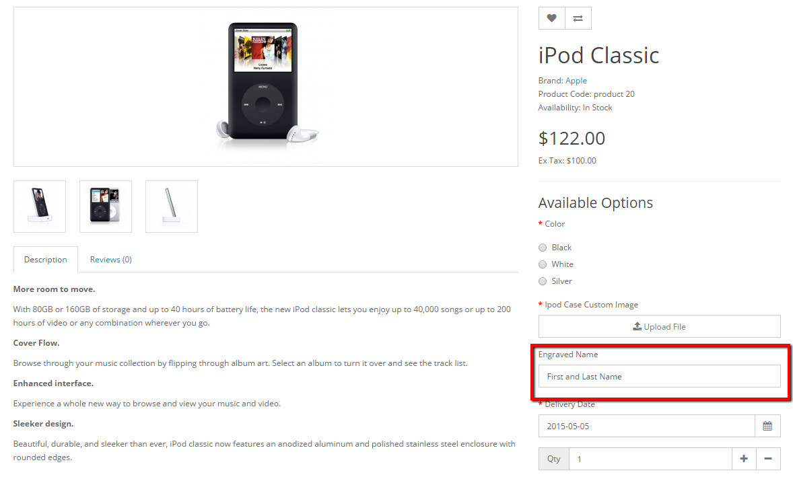
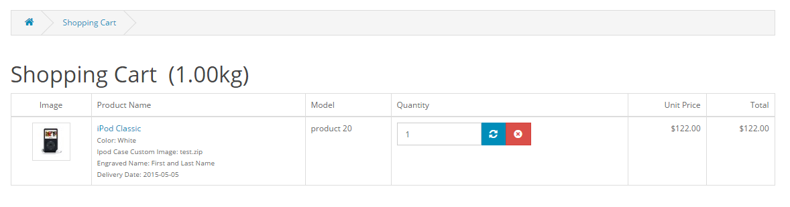

Options
=======

Options in the administration
-----------------------------

The Options section, under Catalog, lets you customize what details the customer sees when checking out a product. On the product page, the "Available Options" section is displayed under the price. The option for that product must be selected before the customer can add the product to the shopping cart.

The image below displays the default options, but you can choose to edit or delete any of them. Essentially, the options can be created to fit whatever added specifications are needed for the customer to purchase the product. The "Insert" button will direct you towards creating a new option.

For example, if you wanted the customer to choose a size for a particular product before checking out, you can create a "Size" option.

The "Type" dropbox will show a variety of ways to display this option:

- **Choose**: Select", Radio, Checkbox, Image"
- **Input**: Text", Textarea
- **File**: File"
- **Date**: Date", Time", Date & Time"

For the "size" option, three option value's were created : "Small", "Medium", and "Large". Images could be added for the option, but since it is referring to size the option value name will suffice. If the option was "Color", having images of the color would be appropriate.

Adding options to products
--------------------------

To apply the options to a specific product, you will need to edit the [Option tab](docs/user-manual/catalog/products/option) under Catalog > Products. Options could to be created prior to adding a product, then added during product creation in the Options tab.

Options in the store front
--------------------------

With the general concept behind "Options" explained above, we can now go into a detailed example of using the Option section to alter the checkout experience in the store front. For this example, we will be adding Options to the iPod Classic product example provided from installation.

The image below was taken from our iPod Classic product page. We can see that product details such as manufacturer, product code, availability, and price are given product details next to the product image. The only interactive option seen below is the "Qty", or quantity. In the space provided next to quantity, the customer can alter the amount of iPod classics to be added to the shopping cart.

For the purpose of this example, we want to add more options to customize the type of iPod Classic that will be purchased by the customer. Under Catalog > Options we will insert new options with varying option values. Arastta allows for four different types of options for customers to select under Options: **Choose**, **File**, **Date**, and **Input**.

### Choose type

The "Choose" Type lets the customer select specific option values. Among these choose types are the following sub-types:

- **Select**: Provides a drop down box where the customer must select an option value.
- **Radio**: Select-able icons with the option values. Only one radio selection can be made; clicking another selection will deselect the previously clicked option and move it to the current selection.
- **Checkbox**: Multiple option values can be checked at once.
- **Image**: Gives a radio selection next to small uploaded images.

In our stock we have different colors of classic iPods: black, silver, and white. The Option Name to describe these colors will be "Color". We decided that we want to use a radio type option to display the color options. We want this option to be the first option in the list, so we gave it a sort order of 1. We added 3 option value names for our colors: Black, White, Silver. If we wanted to, we could have uploaded an image of the iPods in their different colors next to their respective value names using the [Image Manager](docs/faq/image-manager).

Next we will move to the [Options tab](docs/user-manual/catalog/products/option) to add our option to a product under Catalog > Products. This section is different than the Options section under Catalog because it will directly assign a previously created option to a product. We clicked the green '+' icon and typed in Color to bring up our "Color" option that we made under Catalog > Options. In the Option Value column, we added 3 values to enable the Black, Silver, and White option values to be displayed. In addition, we added the quantity of each color available, selected "yes" to subtract stock, and added 10 points to the Reward Points. We could add an increase or decrease in price for select colors, or indicate the weight, but we chose not to.

Saving this Color option under the Options tab will automatically change how this product is viewed on it's product page. The product page can be seen in the screenshot below. Already, we discover that a new section has been added under price named "Available Options". We see our Color Option with the three colors in a radio selection format. The red asterick means that this option must be selected before adding it to the cart. If a selection isn't made, the customer cannot add the product to the Shopping Cart.

### File type

The file type requires the customers to upload a file of their own before adding the product to their cart. In our example, we want the customer to upload an image file before checking out so that we can add the image to a custom iPod case. There is only one option under File Type called File.

When we move to the Option tab under the Catalog > Product to add the option to the product, there is only an selection to require the file or not. There isn't any option values since it is up to the user to upload their own file from their computer.

The result of saving this option can be seen on the iPod Classic product page. The sort order of 2 set the file type option below the Color option. When the customer clicks on the "Upload File" button, they can select a file from their computer that will be included in the checkout.

### Date type

The Date type allows for three different types of selection: Date, Time, or Date & Time.

For our product, we want the customer to include a specified date for delivery, so we title the Option Name as "Delivery Date". We select the Date type because we don't want the exact time to be included. We added a sort order of 4 because we want this to be the last option viewed before the customer adds the product to their cart.

In the Option tab we can determine if it is a required option and what date we want included in the space. The customer can change the date using the calendar on the product page, so the date of the option value doesn't matter too much.

The result of the date type can be seen in the product page image below. The Delivery Date was sort number was 4, so it falls below the Color and Ipod Case Custom Image options.

### Input type

The Input type allows for a text or text area option. The difference between text and text area is that text is one line of blank text to be filled in, while text area gives more space for longer comments. For our iPod Classic we decided that we need an Engraved Name option to engrave the name of the customer on the iPod. We need the customer to type in their first and last name, so we chose the text type. We gave a sort order of 3 because we want the Engraved Name option to be above the Delivery Date.

In the Options Tab under Products we decided that this option doesn't need to be required to check out. In the Option Value we filled in "First and Last Name" so the customer knows to enter their first and last name in the box.

When the option is saved to the product, we can see the Engrave Name section under Ipod Case Custom Image and above Delivery Date. The red asterick is missing because we chose "No" under "Required". The option value shows "First and Last Name" in the box, but the customer can type their own name in that area.

Options displayed in the shopping cart
--------------------------------------

When the customer makes their selection and adds the product to their cart, the shopping cart will display the iPod Classic product options under the Product Name column. Every option selected will be included under the iPod Classic. When the customer checks out, this product information will be included.

The Option section adds another layer of flexibility in customizing product information on product pages. By becoming familiar with the Options tab, you will improve the Arastta transaction process for your customers.
