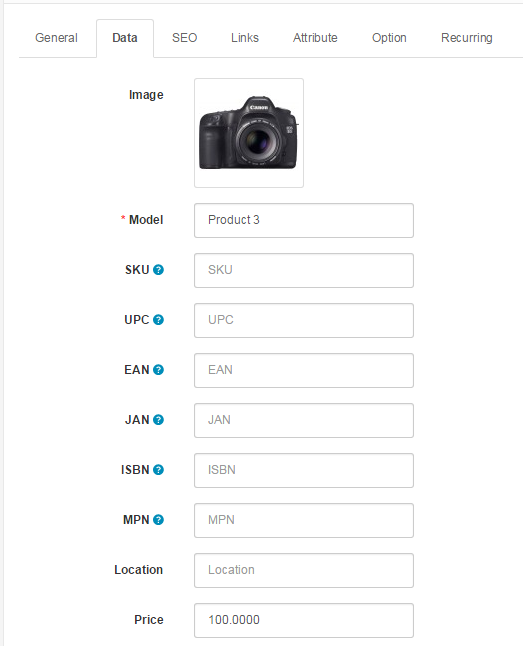

Data
====

Data Tab
--------

The data tab includes all the product criteria that will be included on the product page in the store front for customers to view:

Fill in the spaces above with the following information:

- **Image**: clicking "Browse Folders" will lead the administrator to the [Image manager](docs/user-manual/admin/image-manager) to upload a new image.
- **Model**: create a model number for the product using a combination of letters and numbers. (required)
- **SKU (stock keeping unit)**: a random code for the product.
- **UPC (universal product code)**: the product's unique barcode.
- **EAN (europian article number)**
- **JAN (japanese article number)**
- **ISBN (international standartbook number)**
- **MPN (Manufacturer part number)**
- **Location**: where the product is located.
- **Price**: set a price for the product.
- **Tax Class**: select a tax class category on this product that was made Settings > Localisation > Tax Classes. This will apply the tax in the checkout for the product. Select "None" if taxes will not be applied to this product.
- **Quantity**: The total amount available in the store for this specific product.
- **Minimum Quantity**: the minimum amount of product a customer must reach to add that product to their Shopping Cart.
- **Subtract Stock**: "Yes" will subtract stock from the quantity of the product (Ex: If there are 100 computers, and a customer buys 2 computers, Subtract Stock will change the quantity to 98).
- **Out of Stock Status**: select "Out of Stock", "In Stock", "2-3 days", or "Preorder" as the message shown on the product page when the product's quantity reaches 0.
- **Requires Shipping**: If the product requires shipping, select "Yes". If not, select "No".
- **Data Available**: the date when this product will become available for purchase.
- **Dimensions**: enter the length by width by height of the product if there are dimensions to include.
- **Length Class**: determines the metric units for the dimensions above.
- **Weight**: Enter a number for the weight.
- **Weight Class**: Specify the units of weight for the number entered into "Weight".
- **Status**: Enabling makes the product publicly available in the store. Disabling allows the product to be edited in the administration , but hides it from the store front .
- **Sort Order**: When the product is sorted in a list, a number assigns it a priority. A product with a sorting order or 2 will be placed higher than a product with a sorting order of 3, but lower than a product with a sorting order of 1.
