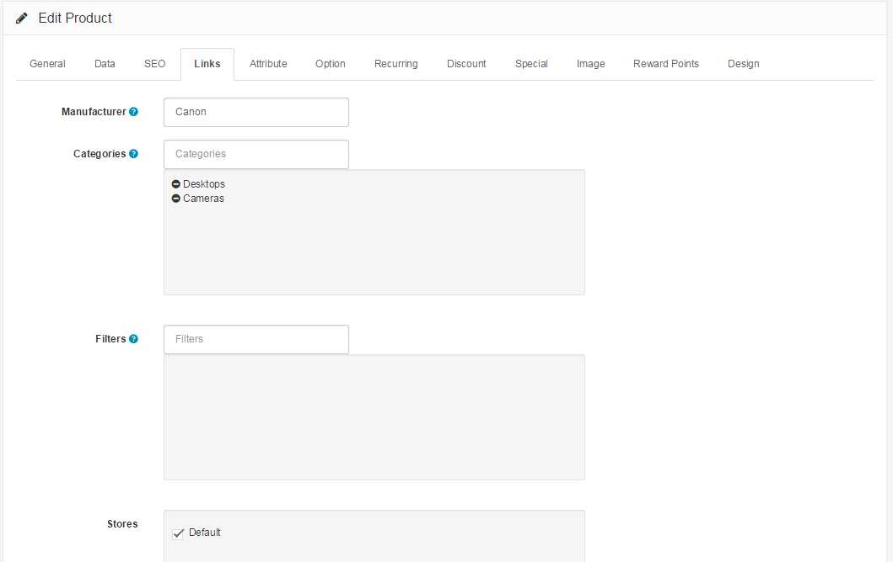

Links
=====

Links Tab
---------

The Links tab specifies which pages Arastta will show the product on:

- **Manufacturer**: Selecting the product's manufacturer will place the product on the manufacturer's page. Select manufacturers can be viewed on the home page if added to the [manufacturer banner](docs/user-manual/catalog/manufacturers).
- **Categories**: Check the categories that the product will be placed into. The product will be listed on the category's page in the store.
- **Filters**: Select the filters to be applied to this product if your Filter module is enabled. See [Filters ](docs/user-manual/catalog/filters)for more information.
- **Stores**: Check which stores will sell this product. Clicking "Default" applies if there is only one store to be managed.
- **Downloads**: If the product is a downloadable product, select the file that will be included with the purchase.
- **Related Products**: In this space, type any related products for this product. These products will be displayed on that product's page for the customer to view. When typing in the space, a drop down box will appear with related products.

