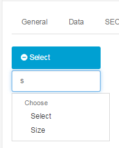

Options
=======

Option Tab
----------

Options are extra selections that a customer can make on the Product page before adding the product to the shopping cart. Options are first created under Catalog > Options, then assigned to a product that is created under Catalog > Products.

One example of an option is "size". Begin by typing "size" into the search box. Size should appear in a drop down box. Select it, and click on the green add button. On the right, click "Add Option Value".

The Option Values were previously created in the [Options ](docs/user-manual/catalog/options)section under Catalog. In this section any option can be added, such as "Large". To subtract from the quantity every time a product is purchased with this option, you can select "Yes" under "Subtract Stock". An increase of price can be added to the option value, points, and weight. Click "Add Option Value" to assign that information to that specific option value. You can click "Remove" to erase the option value. See [Options ](docs/user-manual/catalog/options)for a more in depth explanation of the options feature.
