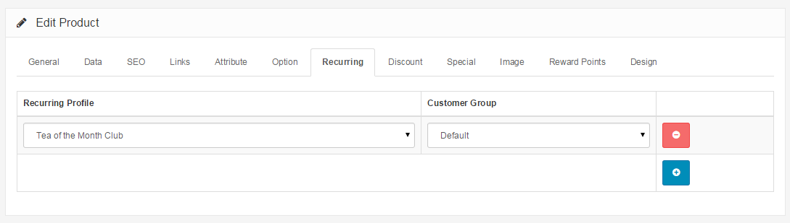

Recurring
=========

Applying Your Profile to a Product
----------------------------------

Once you have created your customer group and added your selected customers to that group, you are ready to apply your profile to a product.

Open your **Catalog > Products ** page and choose a product. Click Edit, then click the **Profile** tab.

Click **Add Profile**, and you will see dropdown boxes appear that will allow you to choose which Profile and which Customer Group to apply to that particular product. When you are finished, click **Save**.

Your new Profile has now been applied to your selected customers for your selected product.
