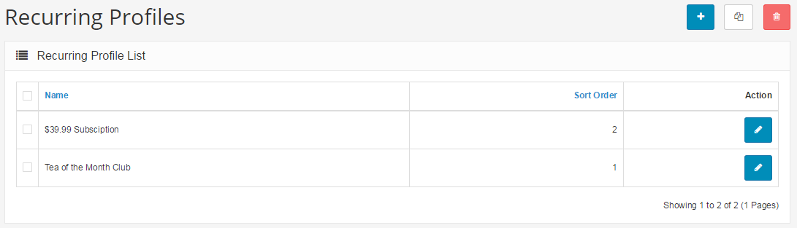

Profiles
========

Recurring Profiles
--------

Profiles are a new, optional feature in Arastta 1.5.6. They allow you to set up recurring payments for your customers. Profiles are useful if you plan to sell products by subscription, if you are promoting a discount or member's club, or if you are simply breaking up payments into smaller portions. This feature gives the store owner more control over how customers are charged for products or services.

In order to set up a recurring payment or view your existing profiles, first open your **Catalog > Profiles Tab**..

Adding New Profiles
-------------------

If you choose to Insert a new profile, you will see the following options:

- **Name:**This will be the name of the subscription or payment plan, such as “$35 per month or Discount Club.
- **Sort Order:**This is simply for putting your profiles into a certain order, to make your top picks easier to find.
- **Status:**You can enable or disable the profile here.
- **Price:**The actual price of the program or subscription. In this example, it is $39.99.
- **Duration:**The number of times a user will make a payment. Set to 0 if unlimited. If unlimited, the payments plan will continue until cancelled by you or the user. In the example, the duration is set to 12 months (for a yearly subscription).
- **Cycle:**The number that will be applied to your frequency option.
- **Frequency:**This option allows you to choose how often a user will make a payment. In the example, the cycle is "1," and the frequency is "month," causing the user to be billed monthly. If you wanted your customer to be billed every three weeks, you would choose "3" as the cycle, and "week" as the frequency.
- **Trial Status:**Here, you may enable or disable a free trial. If disabled, you may leave the following options blank.

Adding a Trial to a Profile
---------------------------

If you choose to enable a free trial or special pre-payment program, the form will ask for the following information:

- **Trial Price:**The price of the subscription or payment plan during the trial period
- **Trial Duration:**The number of times a user will make a payment before the trial expires
- **Trial Cycle:**The number that will be applied to your trial frequency option
- **Trial Frequency:**How often the trial will cycle.

In this example, the trial cycle and trial duration are both set to "1," and the frequency is set to "month," creating a free trial of this plan that lasts one month only. If you wanted to make a free trial that lasted two weeks, you would set trial duration to "1," trial cycle to "2," and trial frequency to "weeks."

Do not forget to Save when you are finished, and you will see your new profile listed on your Profile page. Now, in order to apply your new profile, you must connect it both to a product and to a customer group. Learn more about how to make a customer group on the [Customer Group](docs/user-manual/customers/groups) page.

Applying Your Profile to a Product
----------------------------------

Once you have created your customer group and added your selected customers to that group, you are ready to apply your profile to a product.

Open your **Catalog > Products ** page and choose a product. Click Edit, then click the **Profile** tab.

Click **Add Profile**, and you will see dropdown boxes appear that will allow you to choose which Profile and which Customer Group to apply to that particular product. When you are finished, click **Save**.

Your new Profile has now been applied to your selected customers for your selected product.
