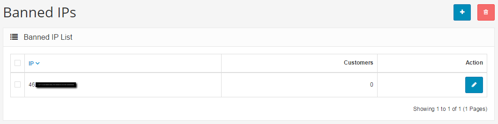

Banned IPs
==========

Arastta provides a feature called "Banned IPs" that will ban an IP address from logging into the store. This step may become necessary if the shop is being harassed by a fraudulent "customer". If you are experiencing harassment from a particular person, their IP address can be copied from the customer list under Customers > Customers. Copy that IP address and go to Customers > IP Blacklist. Click the "Insert" button and paste in the IP address to ban a customer from the store. This will stop users of this IP address from logging into the store again.

