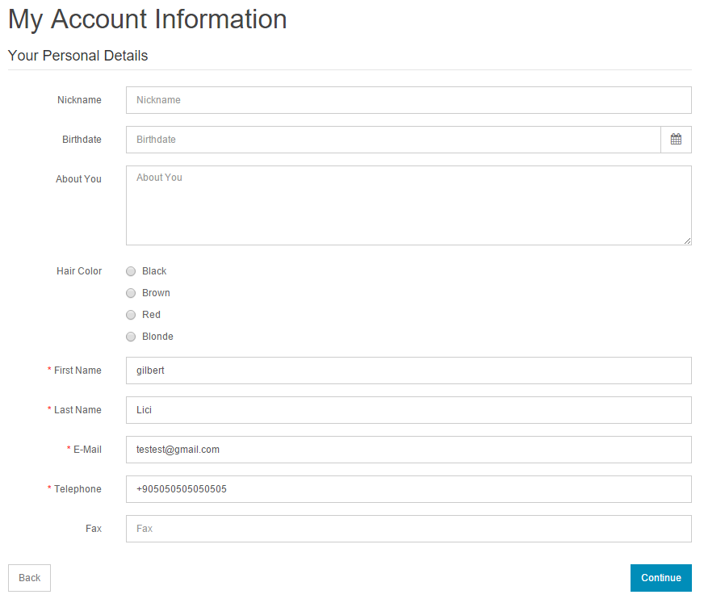

Custom Fields
===============

This feature provides creating custom fields for customers on account and address pages. These fields can be categorized by the Location, it means the Account or Address page, and [Customer Groups](docs/user-manual/customers/groups). In a word, when we create a new custom field we can set it for only 1 (one) group or a few groups or all of them. 

Essentially, the fields can be created to fit whatever added specifications are needed for the customer. The "**Add New**" button will direct you towards creating a new field.

Field are divided into 4 types. The "Type" dropbox will show a variety of ways to display this field:

- **Choose**: Select, Radio, Checkbox
- **Input**: Text", Textarea
- **File**: File"
- **Date**: Date, Time, Date & Time

Here you can see a front-end example of "My Account" page. First 4 fields are custom fields, **Nickname**, **Birthdate**, **About You** and **Hair Color**.

