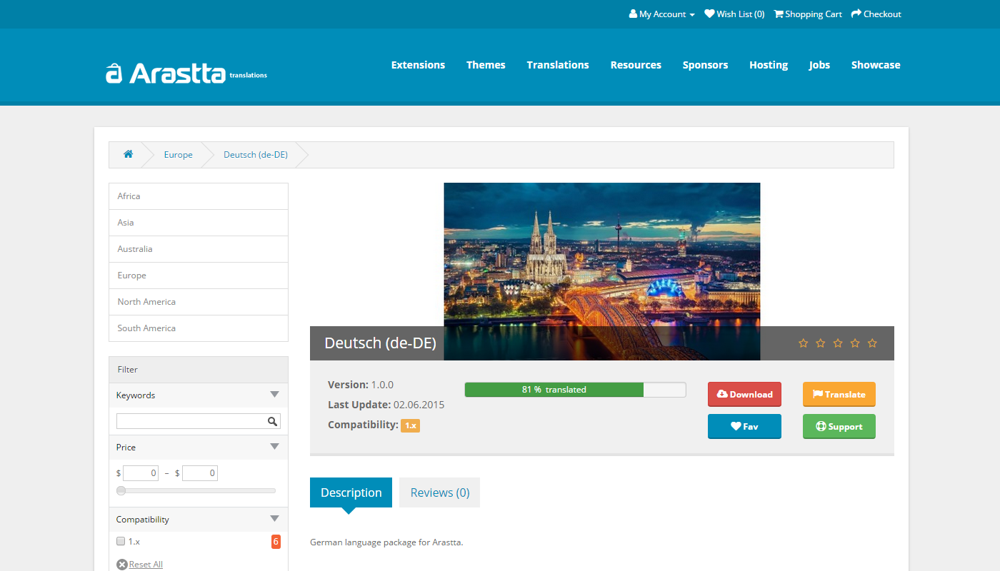
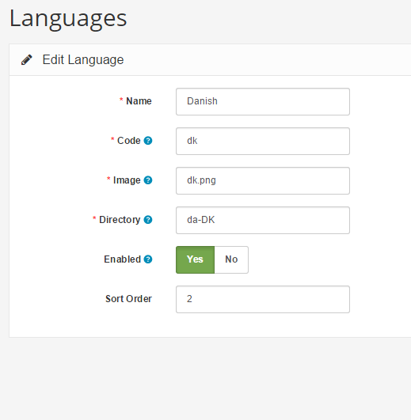

Languages
=========

The language section lets you manage the languages available for the store front. Arastta provides English (en-GB) as the default language after installation. To add multiple languages to the store you need to install a language pack. There are two ways to add new languages:

1) Marketplace
--------------

Adding new language via Marketplace is just one-click away. Just find the language and click on the plus (+) button.

2) Manual
---------

You can also download the language pack from [Translations Directory](http://translations.arastta.pro) and upload it from Extension Installer of Arastta.

Settings
--------

Languages can be set up from Localisation > Languages page. The following information will be needed to save the language:

- **Name**: The name in native language.
- **Code**: The ISO language code. [W3Schools](http://www.w3schools.com/tags/ref_language_codes.asp) has a complete list of ISO codes.
- **Image**: The image used to represent the language, that will be displayed in the header area of the store.
- **Directory**: The language folder name based on [language tags](http://www.w3.org/International/articles/language-tags).
- **Status**: Enables or disables the language in the store front.
- **Sort Order**: Determines the position of the language among multiple languages in the header.

Language determination in store front
-------------------------------------

Arastta will try to determine the store front language based on the visitor's browser settings and your installed languages. If not able to match, the one set from the Settings => Local page will be loaded as per default.

Contribute
----------

Language translations are managed and downloaded live from [Crowdin](https://crowdin.com/project/arastta) platform. You're always welcome to join and help the translation of Arastta.