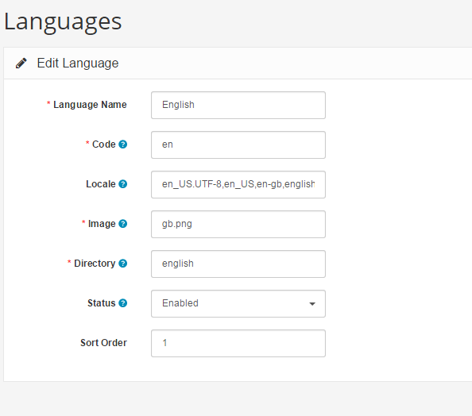

Languages
=========

The language section lets you manage the languages available for the store front. Arastta provides English as the default language after installation. To add multiple languages to the site you need to install a language pack. Language packs can be acquired from the [Extension Directory](http://translations.arastta.pro/). See [Adding multiple languages](docs/user-manual/admin/language) to learn how to add a language pack to Arastta.

The new language can be added to the site under Localisation > Languages. The following information will be needed to save the language:

- **Language Name**
- **Code: **The ISO language code. [W3Schools ](http://www.w3schools.com/tags/ref_language_codes.asp)has a complete list of ISO codes.
- **Locale: **The code used by browsers to auto-detect the language of the site. Locale codes can be viewed [here](https://developer.chrome.com/webstore/i18n#localeTable).
- **Image: **The image used to represent the language, that will be displayed in the header area of the store.
- **Directory: **The location of the language pack (do not include the catalog/language path).
- **Filename: **The name of the language file.
- **Status: **Enables or disables the language in the store front.
- **Sort Order: **Determines the position of the language among multiple languages in the header.

