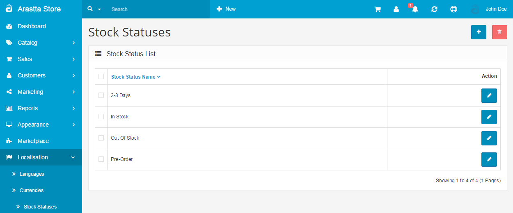

Stock Statuses
==============

In this section you may create Out of Stock statuses to be displayed on the product page when a product is out of stock. The stock status name is arbitrary.

The default stock status for Out of Stock products can be edited under the option tab in [Settings](docs/user-manual/system/settings/option). The specific Out of Stock Status for a product can be edited in the Data tab in [Products](docs/user-manual/catalog/products/data).

