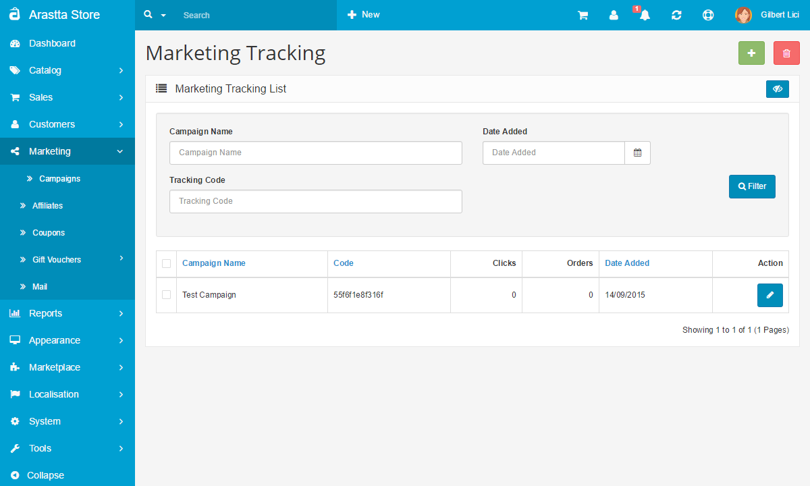

Campaigns
=========

Arastta has a build-in module for creating tracking links for your marketing campaigns. Tracking links are links to your store which include a special tracking code. Any visit via your tracking links will be recorded in the Arastta admin dashboard so you can monitor your marketing campaigns traffic and conversion rate.
 
To create your first marketing tracking link, please login your Arastta admin dashboard and refer to the Marketing section via the main navigation menu.

From the Marketing Tracking List page click on the Add icon to proceed with the configuration of your tracking link. Here you need to configure several settings to create your link:
 
**Campaign Name:** Just any name to help you recognize the campaign for which your tracking code is created.

**Campaign Description:** Any internal note to help you distinguish your tracking link from the rest of your campaigns' links.

**Tracking Code:** This can be any random generated string. This string will be added to the end of your URL links.

Last, you can copy the example of your tracking links. For example, if you would like to point a link to your Arastta home page and track the referrals and orders via it, you may use:

> http://mydomain.com/?tracking=ID

or point to a specific page or product using the full URL to it and add the tracking tag and ID like this:

> http://mydomain.com/index.php?route=common/home&tracking=ID

Make sure you replace 'mydomain.com' with your actual domain name and the 'ID' with your campaign tracking code unique tracking code ID.
