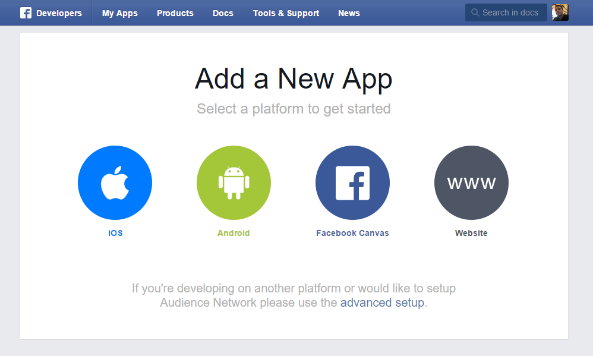
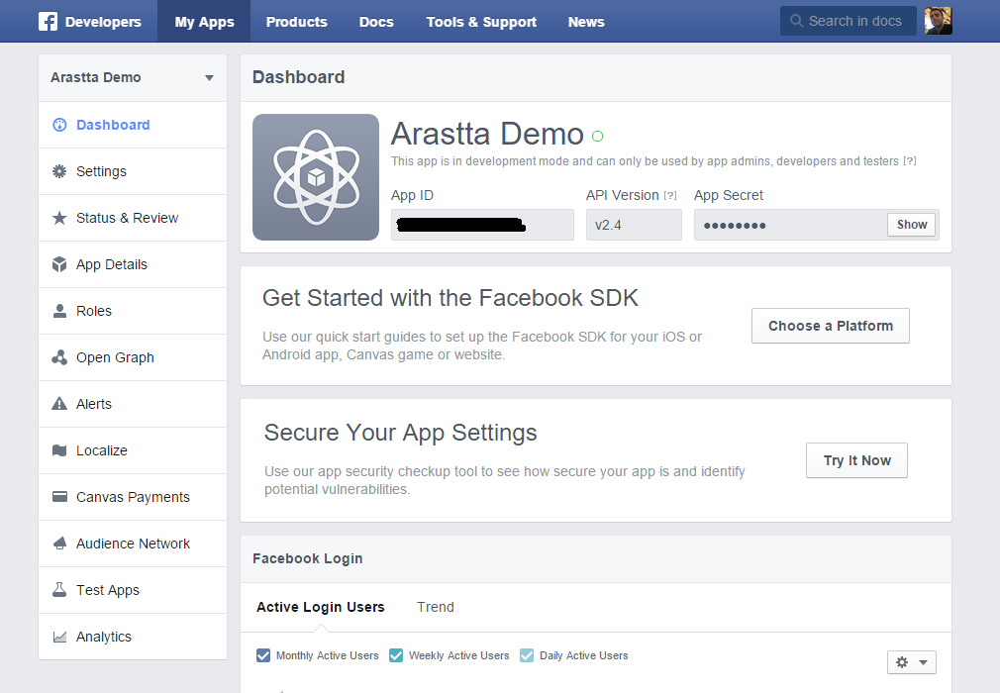

Facebook Store
=====

Sell products on your Facebook Page
-------------

Facebook Store is a great solution for today’s eStore owners since the social media is very important to market your products and gain more customers from all over the world. And Facebook is one of the most popular social channels where you can find millions of people from various interests. So, Facebook Store let’s you turn those people into customers by publishing your products easily on your Facebook page. You can publish any of your products, and once your visitors click any product or category, they will be redirected to your site’s relative page and they can complete the order on the site. That’s it!

Real-time updates
-------------
When adding new products, changing prices, images or even product titles; everything is updated in real-time. So the management of the store is again the Arastta Admin.

### Before you begin

To create a Facebook Store with Arastta you'll need to make sure that:
* You have a business page created in Facebook.
* Your personal Facebook account has Editor or Admin access to your business' Facebook page.
* You have created a Facebook App.

**To create a Facebook page:**

1. Visit the [Facebook Page Creation section](https://www.facebook.com/pages/create).

2. Choose a Page category.
3. Choose a subcategory and enter the required information.
4. Click **Get Started** to accept the [Facebook Pages Terms](https://www.facebook.com/page_guidelines.php) and continue.
5. (Optional) Complete the page set up by offering more information to Facebook:

**To create a Facebook App:**

1. Visit the [Facebook App Creation section](https://developers.facebook.com/quickstarts/).

2. Choose a platform to get started.
3. Create a New App ID or use an existing one.

4. You will be redirected to the Dashboard of the Facebook App.

### Add the Facebook Store

Once your Facebook Page and App registration is complete, you can easily create a Facebook Store using the Arastta Facebook Store feature.

1. Visit the Facebook Store page located in your Arastta Admin => Marketplace => Feeds
2. Click **Install** and then **Edit** buttons

3. Add the **Facebook App ID** that you get from the Dashboard of the Facebook App.
4. There are many options for customizing the view of the store, like Currency, Language, Category, Product Description, Product Price and more.
5. Copy-Paste the "Generated Code" to Facebook so then your store will be integrated with Facebook.
6. Choose modules and products you want to show on Facebook Store.

