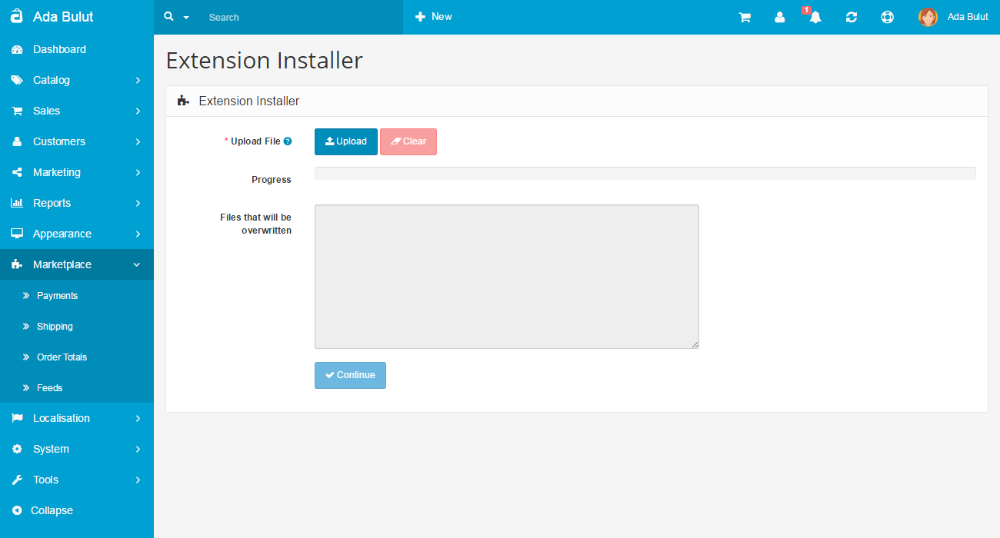
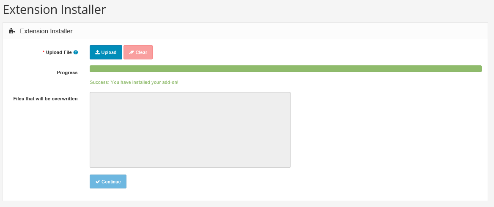

Modifications
=============

Arastta ships with an advanced Modification System, able to read/parse both vQmod and OCmod XML files in the core. Extensions written for both can be uploaded from the [Extension Installer](docs/user-manual/marketplace/extension-installer) page and maintained via the Modifications page (from Marketplace).

You can get more info on [Modification System](docs/developers/modification-system)

To see a list of all the modifications applied to your system go to **Marketplace > Modifications**

You can apply modifications either by uploading a single modification file or a compressed file containing XML, PHP and SQL scripts. Both of these approaches use the [Extension Installer](docs/user-manual/marketplace/extension-installer) as a way to be imported into an Arastta system.

Marketplace Installer
-------------------------

This is the easiest and simple way for installing extensions. Go to "**Arastta admin panel > Marketplace > Extensions**", find and install the extension, for example the Opencart 2 Migration extension.

Extension Installer
-------------------

###Arastta Extensions

Download the extension package from [Arastta Marketplace](http://extensions.arastta.pro/).

Just upload the ZIP file from the **Marketplace > Extension Installer** page. The ZIP file must contain an "upload" folder with the files to be uploaded. The installer does also show the files that will be overwritten, in case there is any, before it runs the extension.

Go to **Marketplace > Modifications** and click on the blue Refresh button (top right corner).

###Uploading a single modification file

To install a modification first you need to upload it. Go to **Marketplace > Extension Installer** and click the upload button.

After clicking upload a popup will open. Locate the modification file on your local drive and click Open. If the upload is successful, you will receive a green success message.

To apply the changes characterised by the uploaded modification file navigate to **Marketplace > Modifications** and click the refresh button at the upper right corner. Once the modifications are applied you will receive a confirmation in the toolbar.

###Uploading a compressed file containing modification files

Arastta allows users to install third party extension which add new feature or extend the default functionality. These extensions are also uploaded through the Extension Installer.

Compressed ocmod files, unlike single ocmod.xml files are not always modifying the core system files. In those cases the zip contains only dedicated extension files. If the extension which is about to be installed requires a modification of some of the core system files, besides the dedicated extension files, install.xml file containing those changes is added to the zip.

Here is a sample file and its content of compressed file containing an install.xml and install.php files:

Here is what those files and folders represent:

"upload" 
- The upload folder contains all of the core files of the extension you are about to install.

"install.php - optional"

- This is an optional file containing custom php scripts implementing any post-installation logic if needed.

"install.xml - optional"

- This is the file which describes the changes which your extension will make to the core system files. It also creates a virtual copy of each one of them and performs the described modifications.
