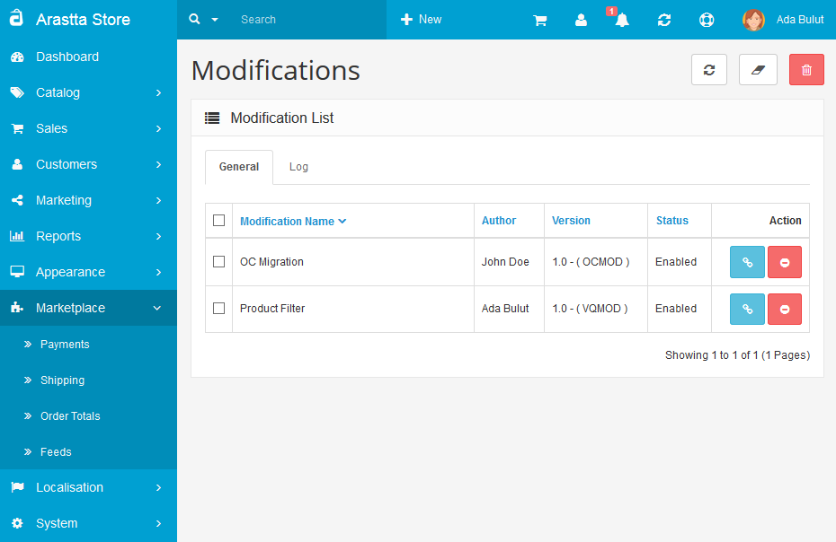

Modifications
=============

Arastta ships with an advanced Modification System, able to read/parse both vQmod and OCmod XML files in the core. Extensions written for both can be uploaded from the Extension Installer page and maintained via the Modifications page (from Marketplace).

You can get more info on [Modification System](docs/developers/modification-system)

