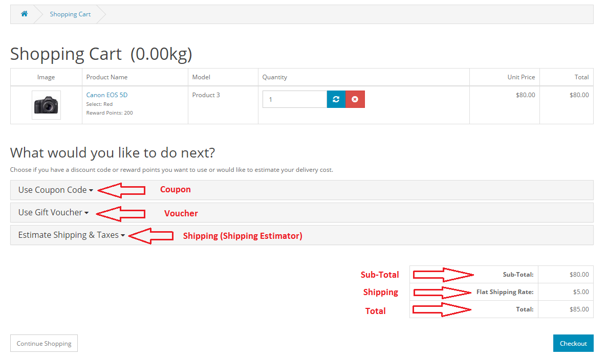

Order Totals
============

Order Totals Extensions
-----------------------

You can manage the order total extensions used for orders under Marketplace > Order Totals. These totals are extra fees that are added to the total sum of an order in the store's shopping cart. For more information on order totals, visit [Orders](docs/user-manual/sales/orders). The order total extensions below are included with the Arastta package.

In the image above we can see that Coupon, Store Credit, Reward Points, Shipping, Sub-Total, Taxes, Total, and Gift Voucher extensions are enabled. These enabled order totals will be included in the checkout section. To disable any of these order total extensions, click "Edit". If you want to remove an extension, click "Uninstall".

### Coupon

Coupons can be added to the order totals page by selecting "Enabled" under "Status". The sorting order affects the order that the extension is put in.

Store credit
------------

Store credit can be added to an order with this extension. The status and sorting order can be selected for checkout.

Handling fee
------------

To include a handling fee with orders, fill in the following information:

- Order Total
- Fee
- Tax Class
- Status
- Sort Order

### Klarna fee

To add a Klarna fee include the following information:

- Order Total
- Fee
- Tax Class
- Status
- Sort Order

### Low order fee

To include a fee if the order amount is too low, include the following information:

- Order Total
- Fee
- Tax Class
- Status
- Sort Order

### Reward points

If you want an option to add reward points to order totals, enable under status and select a sorting orde.

### Shipping

The shipping estimator will automatically estimate how much shipping will cost and add the fee to the order total.

### Sub-total

Select the status and sort order of the sub-totals in checkout.

### Taxes

Select the status and sort order of the taxes in checkout.

### Total

Select the status and sort order of the total amount of the order in checkout.

### Gift-voucher

Select the status and the sort order of the gift-voucher option in checkout.

Order totals in the shopping cart
---------------------------------

The screenshot below displays a basic shopping cart with some specific extensions enabled. Coupon, Gift Voucher, Shipping, Sub-total, and Total are enabled (as seen below).

### Support

To receive support for Order Totals extensions, please visit the [Order Totals](http://arastta.org/forum/categories/listings/extensions) section of the support forum.
