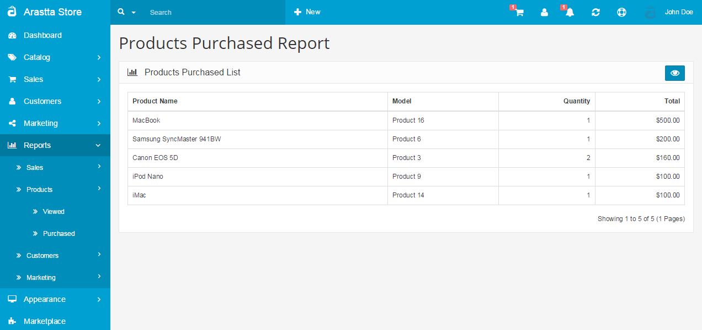

Products Purchased Report
=========================

The Products Purchased Report can be found under **Reports > Products > Purchased**. The report will display the all the products purchased from the store. The products are positioned according to the total amount of money acquired for that product: the highest at the top and lowest at the bottom.

The Filter button lets you customize which products are shown on the list. Selecting a date start and date end will only show the products purchased between those two dates. Selecting an order status will display the all the products purchased within a status, such as Pending or Completed.
