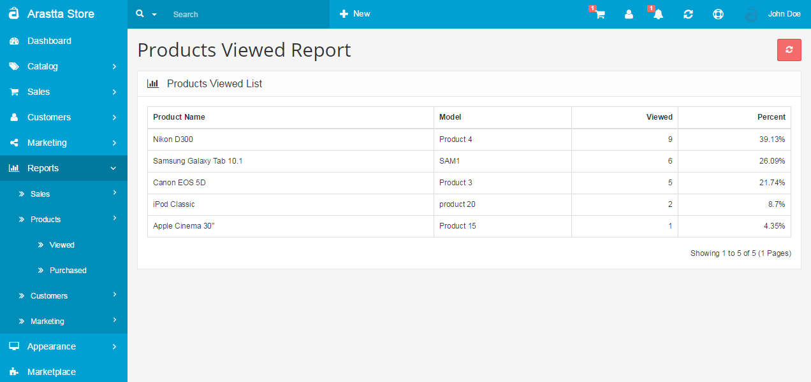

Products Viewed Report
======================

The Products Viewed Report gives you an idea of what products are being viewed the most, or the least, in the store front. You can access this section under Reports > Products > Viewed in the administration side. The report will position the top viewed product first. Along with the product name and model, the report will display the number of customers who viewed that product in the store front, and the percentage of views for this specific product out of all the views for products on the site. Clicking "Reset" will clear the information below and reset the report to only collect information from that moment on.

### Report analysis to increase views

From the report above, you can see that the HP LP 3065 is the most viewed product in this store. To increase the views for products in the bottom of the list, you would need to have a good grasp of what type of factors were involved to place that specific product on top. Was this product advertised on other websites? Was the product image included on the product banners on the home page? Were the products added to the related products of a product page? Were they given a special discount price to a customer group through a newsletter? Most likely, the product with the most views will answer 'yes' to some of these questions. Typically, the products with the least amount of views will have the least exposure on the site out of all the other products. Of course there may be other factors involved, but the more a product has exposure on the store's site through links and images, the more views a product will probably get. Take advantage of the back end features of Arastta to improve the views for the products of a store.
