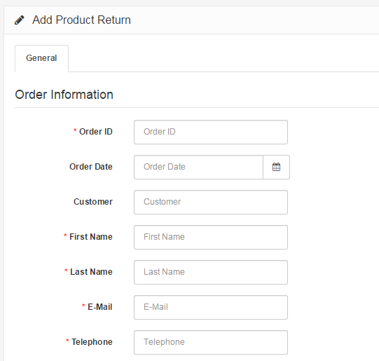

Returns
=======

Adding a new return
-------------------

The Return section under Sales > Returns lets you manage merchandise returns. You must manually enter the product and return information to create a new return. To insert a new return, click the "Insert" button in the right corner above the returns list.

### Return details

Filling in the Returns Details tab is the first step in creating a new return. The following details are required to fill out a return:

- **Order ID**: the ID of the order that was returned.
- **Order Date**: the date that order was made.
- **Customer**
- **First Name**
- **Last Name**
- **E-mail**
- **Telephone**

### Products

The Products section fills out more information about the product that was returned, and why it was returned. You will need to manually type in the product that the customer returned. Typing in "Apple" will bring up all the apple products in the store. We selected the Apple Cinema 30" from the drop down, and the "Model" space was auto-completed for us. You may also include the quantity, the return reason, whether or not the product was opened, the customer's comments, the return action (credit issued, refunded, replacement sent), and return status (awaiting products, complete, pending). The return status names can be added in the [return statuses](docs/user-manual/localisation/returns) section.

Editing a return
----------------

Merchandise returns are automatically added to the Returns section when submitted by the customer. The Returns form is located in the store front on the Returns page, under Customer Service in the footer.

The information filled out in this form will be saved in Sales > Returns. The fields that the customer entered above will be included in the same fields when viewing the return in the administration. You can edit the status of the return to Awaiting Products, Pending, or Completed. When the status is updated in the administration, the customer will be able to view the status of their order under My Account > "View your return requests" in the store front.
