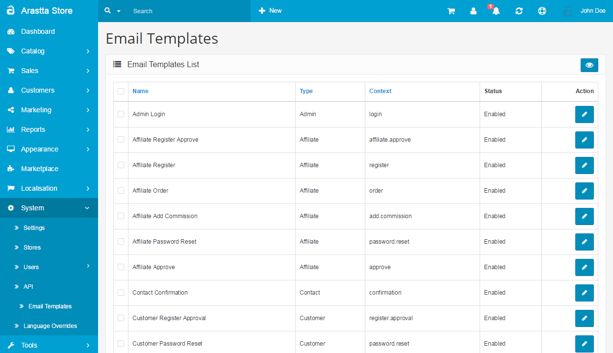
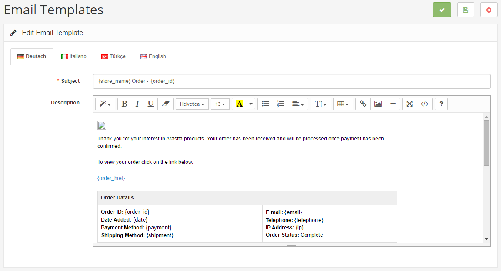
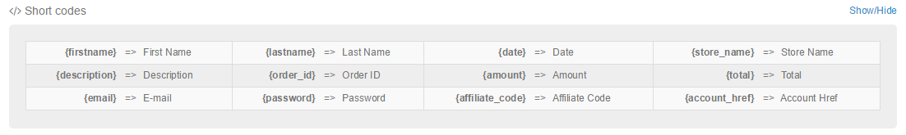
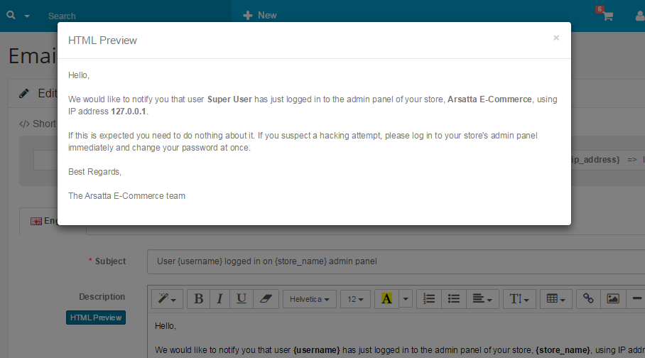

Email Templates
===============

Arastta provides you the service to customize the content of any email that will be sent from your store. This service can be achieved from "**System > Email Templates**".

As the multi-language is one of most powerful features of Arastta, emails are **fully multi-language** and there are predefined tags to replace dynamic variables such as customer name, order id etc.

##Short codes

##HTML Preview

##Some Predefined Tags

* **{store_name}**  :  The Store Name
* **{store_url}**  :  The Store Url
* **{order_id}**  :  The Order ID
* **{order_href}**  :  Order Link
* **{account_href}**  :  My Account Link
* **{activate_href}**  :  Activation Link
* **{firstname}**  :  First Name
* **{lastname}**  :  Last Name
* **{email}**  :  E-mail
* **{password}**  :  Password
* **{telephone}**  :  Telephone
* **{date}**  :  The date added
* **{payment}**  :  Payment Method
* **{shipment}**  :  Shipping Method
* **{payment_address}**  :  Payment Address
* **{shipping_address}**  :  Shipping Address
* **{delivery_address}**  :  Delivery Address
* **{ip_address}**  :  IP Address
* **{ip}**  :  IP Address
* **{comment}**  :  The Comment text
* **{client_comment}**  :  The Client Comment text
* **{product_name}**  :  The Product Name
* **{product_model}**  :  The Product Model
* **{product_quantity}**  :  The Product Quantity
* **{product_price}**  :  The Product Price
* **{total}**  :  The Total
* **{product_total}**  :  The Total
* **{total_title}**  :  The Total Title
* **{total_value}**  :  The Total Value
* **{commission}**  :  The Commission Value
* **{amount}**  :  The Amount Value
* **{enquiry}**  : Contact Message
* **{product}**  :  The Product
* **{author}**  :  The Reviewer
* **{rating}**  :  Rating
* **{review}**  :  The Review Text