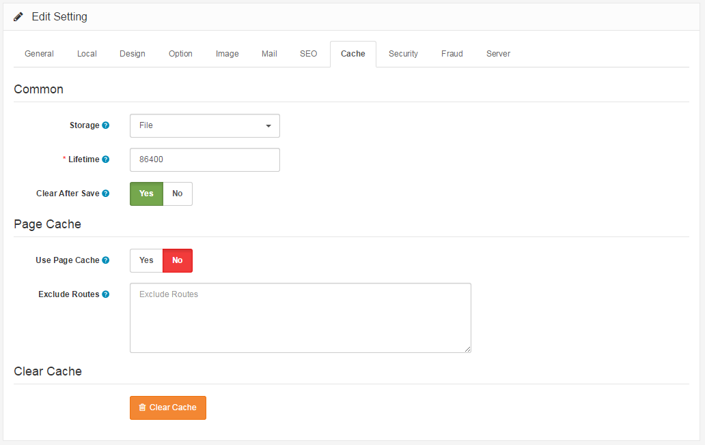

Cache
=====

Caching is a valuable method of increasing load speeds by keeping a resources on the user’s web browser after the first visit on your Arastta store. But the website itself also has a cache and sometimes changes made on it will not be visible to the users unless you clear that cache.

The cache tab under settings displays the following fields: Common, Page Cache:

### Common

- **Storage:** Select the storage to save the cached data. All options except File require a specific PHP extension to be installed in your server. Please, check the documentation for further details.
- **Lifetime:** The maximum length of time in seconds for a cache file to be stored before it is refreshed. Default: 86400 (24 hours)
- **Clear After Save:** Clear the cache after a product, category, manufacturer, information is created/edited (Highly recommended)

### Page Cache

- **Use Page Cache:** Page Cache acts as like a page snapshot. It's super fast as it caches everything in HTML format. The cache is created on the first page visit by the first visitor of the store. After that, all other visitors will get this page loaded from the cache. Not applicable when visitor logged in or added product to cart or is in cart/checkout page.
- **Exclude Routes:** Route values (i.e. common/home) to be excluded from the Page Cache. Enter one route per line.

To completely clear the cache on your website, click on the orange **Clear Cache** button.