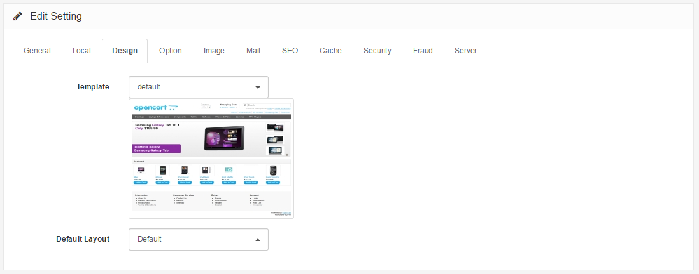

Design
======

Design Tab
----------

The design tab under Settings displays the following fields:

- **Template: **Selects the template/theme of the store. Arastta only has one, "default". [Arastta Themes](http://themes.arastta.pro/) is a great resource for discovering 3rd party templates for Arastta.
- **Default Layout**: The default layout type for the store.

