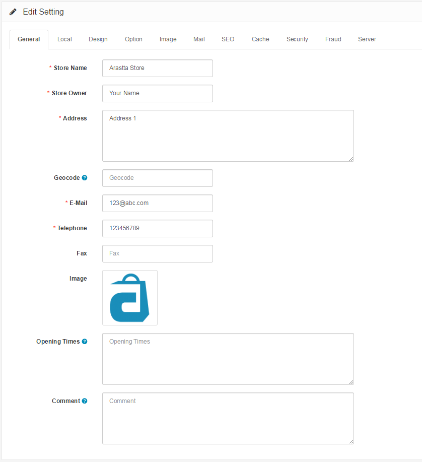

General
================

General Tab
-----------

The general tab under Settings displays the following fields:

- **Store URL: **The url of the store. Remember to include the 'http:' in the beginning and a '/' at the end.
- **Store Name**: The name of the store. This information will be displayed in the Contact Us page under the Customer Service section of the footer.
- **Store Owner**: The name used in the "From:" section of any email sent from the store.
- **Address**: The address of the store. This information will be displayed in the Contact Us page under the Customer Service section of the footer.
- **E-mail**: The store owner's email, or general email for the store, to be used for email notifications sent by Arastta.
- **Telephone**: A telephone number for the store. This information will be displayed in the Contact Us page under the Customer Service section of the footer.
- **Fax** (optional): A fax number for the store. This information will be displayed in the Contact Us page under the Customer Service section of the footer.

