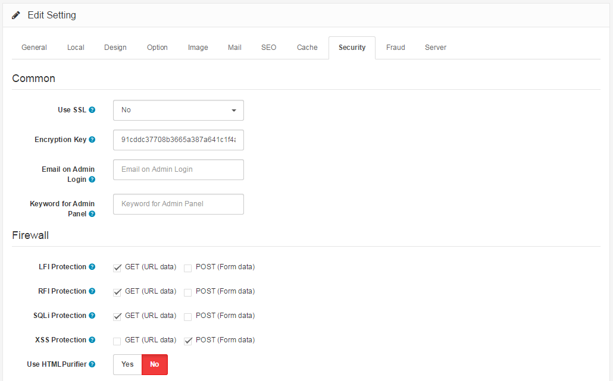
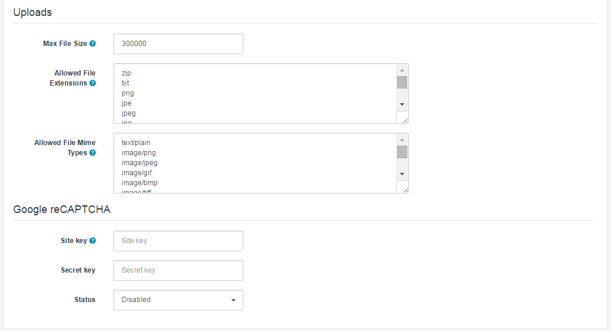

Security
========

Security Tab
------------

Security should be a top priority for every website especially if there is sensitive information involved. As most online stores work with payment and shipping details and even credit card information it is very important to have the maximum security possible. Here Arassta excels compared to its predecessor OpenCart by implementing new security features and firewall methods that can stop most malicious attempts towards your store.

The security tab under settings displays the following fields: Common, Firewall, Uploads, Google reCAPTCHA:

### Common & Firewall

- **Use SSL:** Enable HTTPS on your store. This requires a valid SSL certificate installed on your webserver.
- **Encryption Key:** Enter a combination of numbers and letters to encrypt private information.
- **Email on Admin Login:** Enter an email address to be notified upon a successful login of anyone in your admin panel. Leave blank to not be sent a notification.
- **Keyword for Admin Panel:** Enter a keyword to access the admin panel such as 'mypanel' so that the system will require it to be in the link like domain.com/admin?mypanel. Leave blank to disable it.
- **LFI Protection:** (Local File Inclusion) This feature will try to protect against directory traversal techniques (such as route=../../../etc/passwd) that might allow an attacker to read sensitive files.
- **RFI Protection:** (Remote File Inclusion) This feature will try to protect against access to URLs (such as route=http://www.malicious-site.com/exploit.txt) that might allow an attacker to download and run malicious scripts.
- **SQLi Protection:** (SQL Injection) This feature will try to protect against common SQL injection attacks (such as SELECT xyx FROM users) that might allow an attacker to get sensitive data from your database.
- **XSS Protection:** (Cross Site Scripting) This feature will try to protect against Javascript attacks that might cause connection drop.
- **Use HTMLPurifier:** HTMLPurifier Library offers higher security level by cleaning the content of request variables. Enabling this option may affect the page load slightly.

### Uploads & Google reCAPTCHA

- **Max File Size:** The maximum image file size you can upload in [Image Manager](faq/image-manager). Enter as byte.
- **Allowed File Extensions:** Add which file extensions are allowed to be uploaded. Use a new line for each value.
- **Allowed File Mime Types:** Add which file mime types are allowed to be uploaded. Use a new line for each value.
- **Site key:** Go to [Google reCAPTCHA](https://www.google.com/recaptcha/intro/index.html) page and register your website.