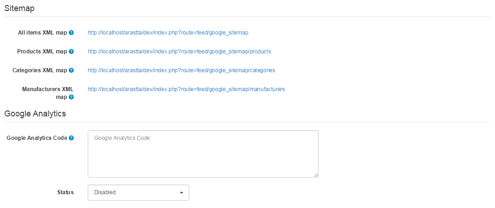

SEO
===

SEO Tab
-------

The SEO tab under Settings displays the following fields:

### SEO URLs

- **Use SEO URLs:** Enable SEO URLs if you want to get pretty URLs and better results with search engines.
- **Remove index.php:** To remove index.php, Apache mod_rewrite module must be installed in your host/server and you need to rename the htaccess.txt to .htaccess .
- **Add Suffix to URLs:** Append .html suffix to the SEO URLs.
- **Add Category to Products URLs:** Select whether to prepend the category slugs to product URL.
- **Translate URLs:** Translate URLs based on the selected language. 
- **Add language code to URLs:** Prepend the language code (en, de) to the SEO URLs.
- **Use canonical links:** Add canonical link to header for pagination, sorgint etc URLs.
- **www Redirection:** Select whether to redirect to with or without www prefix.
- **non-SEO to SEO URLs Redirection:** Select whether to redirect to the SEO URL if the URL is non-SEO.

### Metadata

- **Meta Title:** A title of the store to describe the store page to search engines.
- **Add to other titles:** Add the store title into other pages (product, category, manufacturer etc.) title like My Store - My Product.
- **Meta Description**: A summary of the store to describe the store page to search engines.
- **Meta Keywords**: Similar to meta tag description, but asks for a single keyword to describe the store.
- **Meta Generator:** The generator meta tag is generally used to show the company/program that has built the site.
- **Meta Google Key:** Enter your Google Site Verification Key to verify your site.
- **Meta Alexa Key:** Enter your Alexa Site Verification Key to verify your site.

### Sitemap & Google Analytics

- **All items XML map:** The XML Sitemap link for all store items (products, categories, manufacturers, informations and other pages). The content is updated automatically whenever you create a new item.
- **Products XML map:** The XML Sitemap link for products. The content is updated automatically whenever you create a new item.
- **Categories XML map:** The XML Sitemap link for categories. The content is updated automatically whenever you create a new item.
- **Manufacturers XML map:** The XML Sitemap link for manufacturers. The content is updated automatically whenever you create a new item.
- **Google Analytics Code:** Enter the code provided for the store site from the store's Google Analytics account here.
